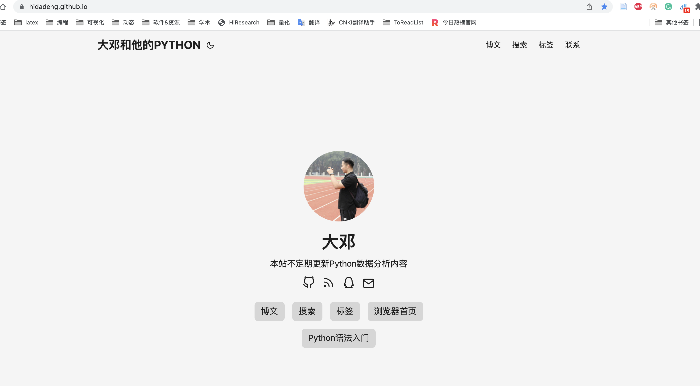
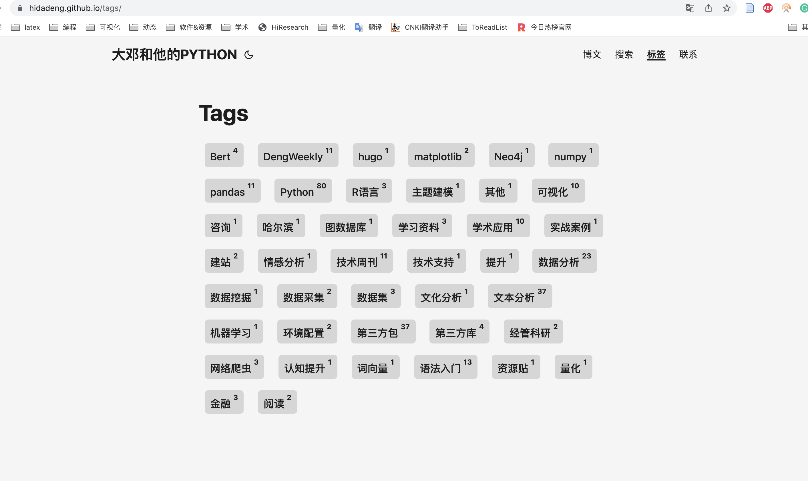
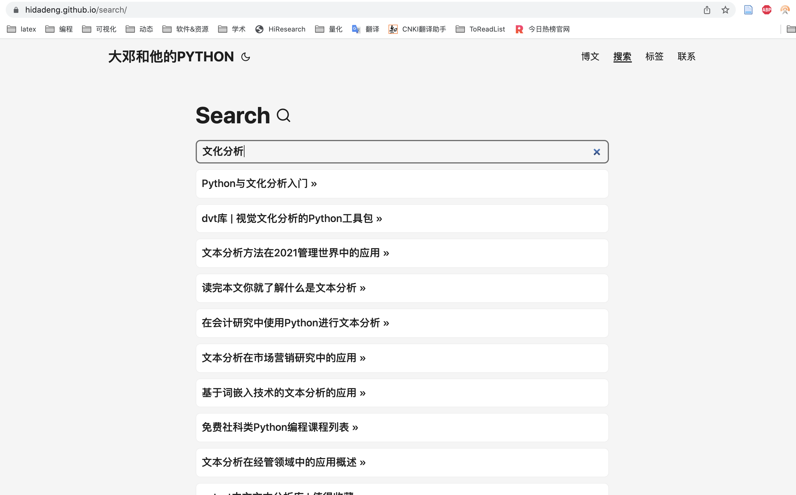
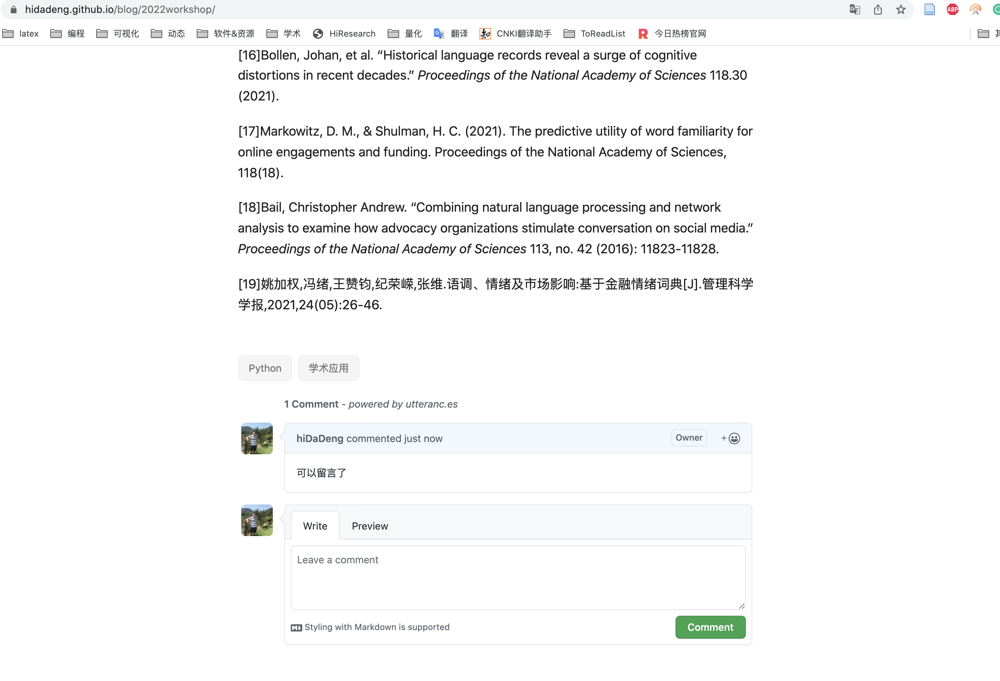
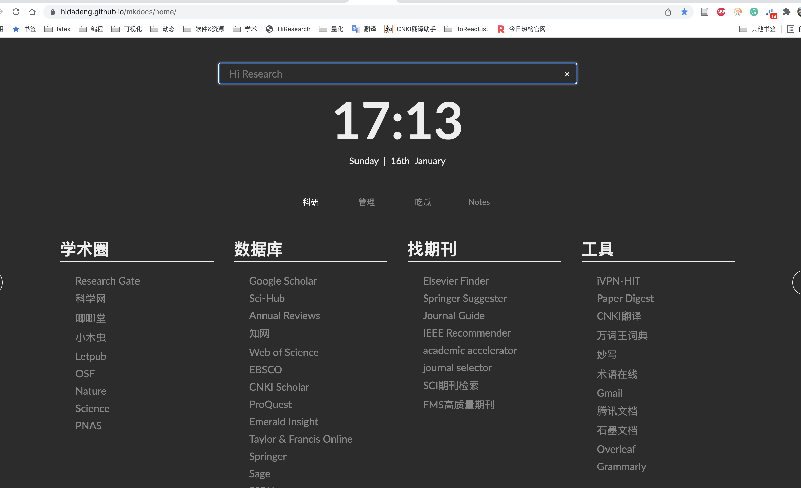

# hidadeng.github.io
https://hidadeng.github.io

 

目前博客使用的建站技术有

- [Hugo](https://github.com/gohugoio/hugo)框架建站
- [PaperMod](https://github.com/adityatelange/hugo-PaperMod)网站主题风格
- [MkDocs](https://github.com/mkdocs/mkdocs) 生成技术文档
- [utterances](https://github.com/utterance/utterances) 留言功能
- [浏览器首页](https://hidadeng.github.io/mkdocs/home/) 学术浏览器首页

 

## 网站仓库

博客的所有代码文件存储于[hiDaDeng/hidadeng.github.io](https://github.com/hiDaDeng/hidadeng.github.io)。大家如果想爬大邓的博客，速度还是太慢，可以直接从这里下载项目。

 

## 主题风格

博客之前换过很多种主题，有商务风、极客风，最后发现还是简单最好。而PaperMod不止简洁，还支持标签、搜索等功能。

 

## 技术文档

大邓课程培训[Python快速入门](https://hidadeng.github.io/mkdocs/python_tutorial/)基础教程，使用MkDocs框架生成技术文档，界面如图

 

## 留言功能

博客使用[utterances](https://github.com/utterance/utterances)调用github仓库资源，用于存储评论数据。评论系统有点慢，需要先有github账户才可以使用。日常大家如果对Python感兴趣，有什么好的想法、资料，欢迎在博客中留言。

 

## 学术浏览器首页

如果你也是经管背景，对Python感兴趣，可以点击收藏该[学术首页](https://hidadeng.github.io/mkdocs/home/)

如果想生成自己学科的学术首页，可以点击[制作方法](https://hidadeng.github.io/blog/浏览器首页/)查看diy详情

