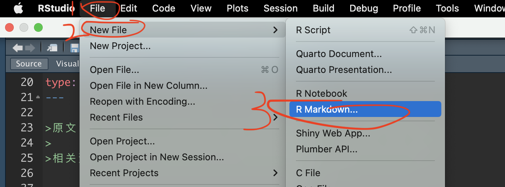
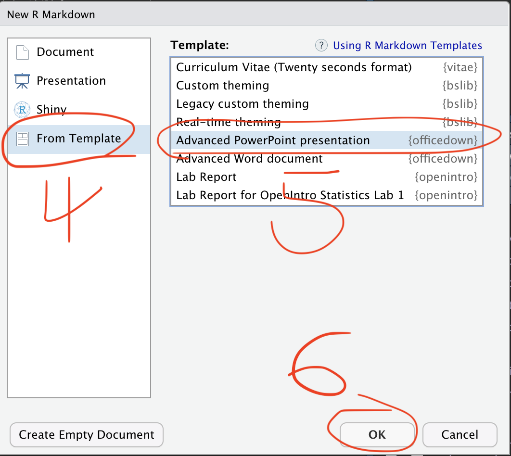
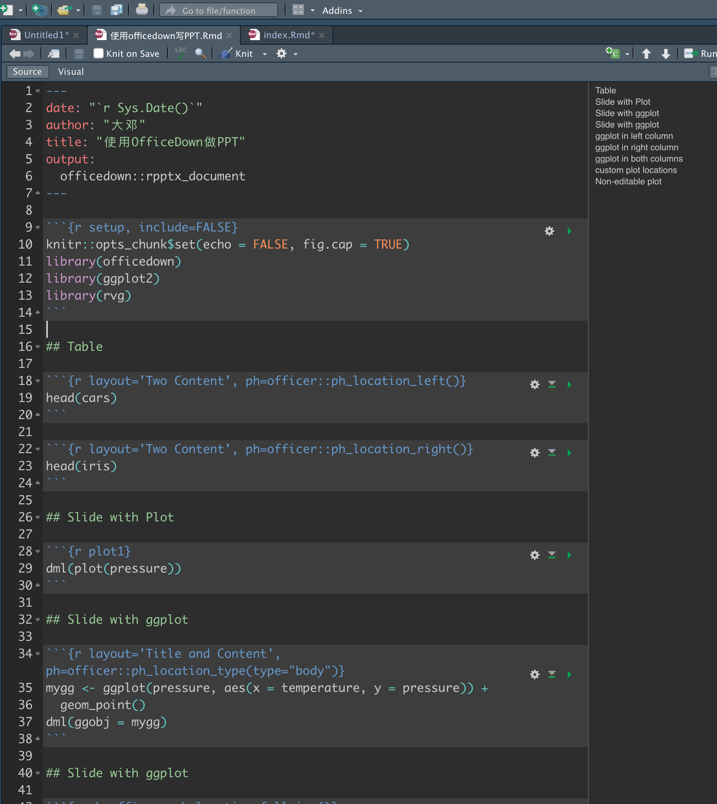
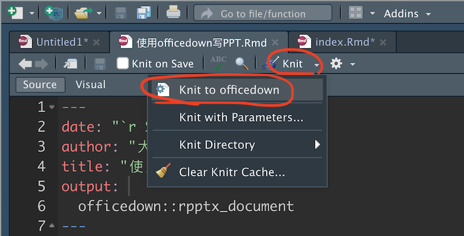
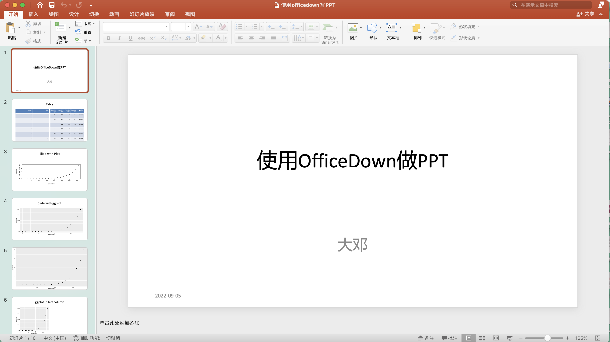

使用officedown在Rmarkdown中写PPT/Word。本文只以PPT为例简单演示，不做细节讲解。

## 安装

```{r eval=F}
install.packages(c("officedown", "rvg"))
```

<br>

## 新建Rmd
按照截图，



会自动新建一个Rmd模板。


如果你自己想改动添加内容，自己改就行不用怕，大不了重新新建一个空白模板。

<br>

## 渲染
内容Okay后，点击渲染



渲染时会自动弹开MS PowerPoint




<br>

## 相关资料

- https://www.miriamheiss.com/posts/graphing-with-ggplot/
- https://ardata-fr.github.io/officeverse/index.html

<br>

## 广而告之

-   [长期征稿](https://hidadeng.github.io/blog/call_for_paper/)
-   [长期招募小伙伴](https://hidadeng.github.io/blog/we_need_you/)
-   [付费视频课 \| Python实证指标构建与文本分析](https://hidadeng.github.io/blog/management_python_course/)
