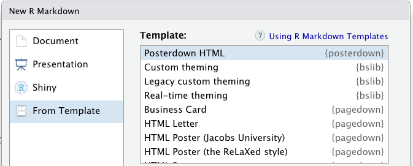
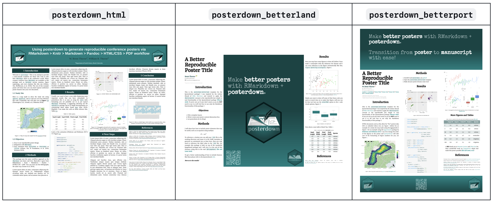
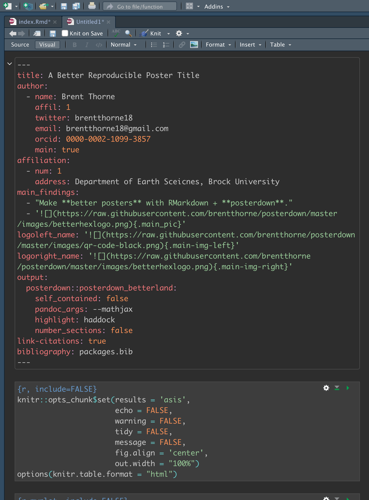

>原文: https://shilaan.rbind.io/post/academic-conference-posters-using-posterdown/


如果你认识我，你就会知道我喜欢用 R语言 做任何事情。 当需要创建我的第一个学术会议海报时，我知道我不想浪费任何时间在不同的软件环境之间移动或复制粘贴和手动格式化文本、表格、图形和结果。

相反，我想使用 RMarkdown 生成一个完全可复制且格式精美的会议海报。 原来; R 包 [posterdown](https://github.com/brentthorne/posterdown) 使这变得非常简单！ 在这篇文章中，我将简要向您展示如何使用 posterdown 包创建自己的海报。

要先睹为快，您可以在此处找到我的第一个 posterdown 创建的 [海报](https://sjdm.org/presentations/2021-Poster-Alzahawi-Shilaan-crowds-variability-credibility~.pdf) 以及此处的[基础代码](https://github.com/shilaan/Many-Analysts/blob/main/poster/GSPA_Poster.Rmd)。

<br>

## 安装

```{r eval=F}
install.packages("posterdown")
```

<br>

## 新建Rmd
按照下面步骤点击从模板新建Rmarkdown
``File -> Net File -> R Markdown -> From Template``



从中选择posterdown模板，有三种可供选择的子模板，即
- Posterdown HTML
- Posterdown betterland
- Posterdown Betterport

大致的样式如下



虽然 HTML 模板看起来更像是经典的科学海报，但 Betterland 和 Betterport 模板创建的海报具有大量空间，专门用于呈现高传递性的(take-away)信息。
后两者的区别在于，Betterland 是横向的，而 Betterport 是纵向的。


<br>

## 个性化

当选择了模板，就可以在Rmd文件内修改内容。如果对字号、字体等不太满意，还可以在修改yaml部分参数。



最后点击Knit即可渲染出学术会议海报


<br>

## 参考资料
- https://shilaan.rbind.io/post/academic-conference-posters-using-posterdown
- https://github.com/brentthorne/posterdown


<br>

## 广而告之

-   [长期征稿](https://hidadeng.github.io/blog/call_for_paper/)
-   [长期招募小伙伴](https://hidadeng.github.io/blog/we_need_you/)
-   [付费视频课 \| Python实证指标构建与文本分析](https://hidadeng.github.io/blog/management_python_course/)
