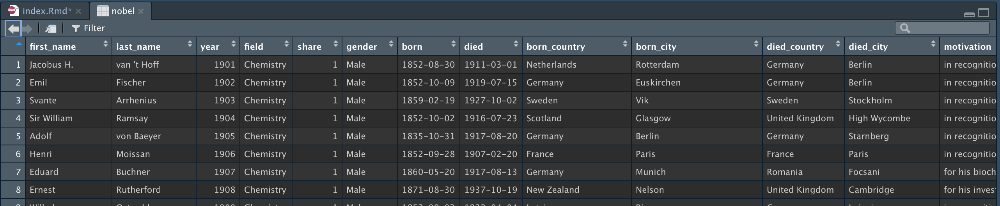

> 原文: <https://www.miriamheiss.com/posts/histogram-ggplot/>

之前分享过 [R语言 \| ggplot2简明绘图之散点图](https://hidadeng.github.io/blog/2022-09-04-r-ggplot2-simple-tutorial/),是以散点图为例简单讲解ggplot2的绘图，今天我们将以直方图作为主讲图形。


直方图是另一种ggplot2常用的图形，与散点图类似，也是分多个图层进行逐层绘制。

<br>

## 准备

导入本文要用到的包

```{r}
library(magrittr) 
library(ggplot2)
library(primer.data) #准备数据
library(showtext)
showtext_auto()  #显示中文

#install.packages("MetBrewer")
library(MetBrewer) #配色包
```

<br>

## 选择数据

使用data()函数可以查看现有的数据集有哪些，

```{r}
data()
```

这里选择nobel，使用View(nobel)可以在新打开一个窗口，方便了解数据

```{r}
View(nobel)
```



<br>

## 画布gglot

画画需要画布，对于数据分析的绘图也是同理。导入相关R包后， 用ggplot函数构造一个画布。因为还没设定数据，所以这是一个空画布

```{r}
ggplot()
```

我们将使用 nobel数据集，传入数据的代码ggplot(data=nobel)

```{r}
ggplot(data=nobel)
```

画布看起来依然是空白的，不要紧张。理解这个之前类比PS这类绘图软件，将修图工作看做是很多个图层的叠加。现在我们使用时依然在最底层的ggplot图层，在ggplot函数内添加mapping=aes()参数，准备添加x轴、y轴、color。的图层。

```{r}
ggplot(data=nobel,
       mapping=aes())
```

注意了，现在图层即将发生变化。我们选择设置x轴 `aes(x=year)`

-   x轴 year

```{r}
ggplot(data=nobel,
       mapping=aes(x=year))
```

现在我们将开始添加高层次的图层，也会显示越来越多的信息。

<br>

## 添加geom

现在添加geom层，该层是通过 `+` 构建在ggplot层之上。这里使用 `geom_histogram()` 绘制直方图，

```{r}
ggplot(data=nobel,
       mapping=aes(x=year))+
  geom_histogram()
```

不错，接下来添加color

<br>

## fill和color

按照学科对每个时期的诺奖进行专业分类，使用aes中的fill参数。

```{r}
ggplot(data=nobel,
       mapping=aes(x=year, fill=field))+
  geom_histogram()
```

但同一时期，不同专业之间没有边界区分，容易混乱。这里设置 `geom_histogram()` 的 `color="white"`。

```{r}
ggplot(data=nobel,
       mapping=aes(x=year, fill=field))+
  geom_histogram(color="white")
```

<br>

## 更改配色

更改geom层的颜色，所以该层紧贴geom层，且在geom层之上。设置方法可以使用 `scale_fill_manual()` 即可。`scale_fill_munual()` 中的values可以传入颜色字符串。

```{r}
ggplot(data=nobel,
       mapping=aes(x=year, fill=field))+
  scale_fill_manual(values=c("red",
                             "orange",
                             "yellow",
                             "green",
                             "blue",
                             "purple"))+
  geom_histogram(color="white")
```

漂亮！ 这些颜色真的很明艳， `scale_fill_munual()` 还可以选择十六进制颜色字符串进行颜色自定义

```{r}
ggplot(data = nobel,
       mapping = aes(x = year,
                     fill = field)) +
  scale_fill_manual(values = c("#f73c39",
                               "#f79b39",
                               "#f7ee39",
                               "#228c14",
                               "#1e80c7",
                               "#7c148c")) + 
  geom_histogram(color = "white")
```

<br>

## 配色包MetBrewer

对于我们普通人而言， 不需要记住那么多颜色，只需要在配色方案中选择好看的配色即可。 [MetBrewer](https://github.com/BlakeRMills/MetBrewer)是R语言的配色包，在文章开头已经提前导入了。下图是MetBrewer的配色方案，选择一种配色方案的名字,如Signac


```{r}
ggplot(data = nobel,
       mapping = aes(x = year,
                     fill = field)) +
  #选择Signac配色方案，使用其中6种颜色
  scale_fill_manual(values = met.brewer('Signac', 6)) + 
  geom_histogram(color = "white")
```

<br>

## 标签labs

现在我们需要用`labs()` 函数给图片添加标签图层。例如title、subtitle、caption、x、y、legend。

```{r}
ggplot(data = nobel,
       mapping = aes(x = year,
                     fill = field)) +
  scale_fill_manual(values = met.brewer("Signac", 6)) + 
  geom_histogram(color = "white") +
  labs(title = "Nobel prize laureate numbers have gone up in past 50 years",
       subtitle = "Physics, Medicine, and Chemistry have largest numbers of laureates",
       x = "Year",
       y = "Number of laureates")
```

现在x轴、y轴、标题都是大写，需要将field也大写。这里在labs(fill='Year')更改year为Year

```{r}
ggplot(data = nobel,
       mapping = aes(x = year,
                     fill = field)) +
  scale_fill_manual(values = met.brewer("Signac", 6)) + 
  geom_histogram(color = "white") +
  labs(title = "Nobel prize laureate numbers have gone up in past 50 years",
       subtitle = "Physics, Medicine, and Chemistry have largest numbers of laureates",
       x = "Year",
       y = "Number of laureates",
       fill='Field')
```

<br>

## 中文

默认ggplot2不支持中文，为了能显示中文，使用showtext包。前文已提前导入并初始化

    library(showtext) #支持中文
    showtext_auto()

运行中文的代码

```{r}
#把学科转为中文
nobel2 <- nobel %>% 
  mutate(
    field = case_when(field=='Chemistry' ~ '化学',
                       field=='Economics' ~ '经济学',
                       field=='Medicine' ~ '经济学',
                       field=='Peace' ~ '和平',
                       field=='Physics' ~ '物理学',
                       field=='Literature' ~ '文学'))


#绘图
ggplot(data = nobel2,
       mapping = aes(x = year,
                     fill = field)) +
  scale_fill_manual(values = met.brewer("Signac", 6)) + 
  geom_histogram(color = "white") +
  labs(title = "过去50年诺贝尔奖得主人数一直保持增长趋势",
       subtitle = "物理学、医学和化学的获奖者人数最多",
       x = "年份",
       y = "获奖人数",
       fill='领域')
```

<br>

## 广而告之

-   [长期征稿](https://hidadeng.github.io/blog/call_for_paper/)
-   [长期招募小伙伴](https://hidadeng.github.io/blog/we_need_you/)
-   [付费视频课 \| Python实证指标构建与文本分析](https://hidadeng.github.io/blog/management_python_course/)
