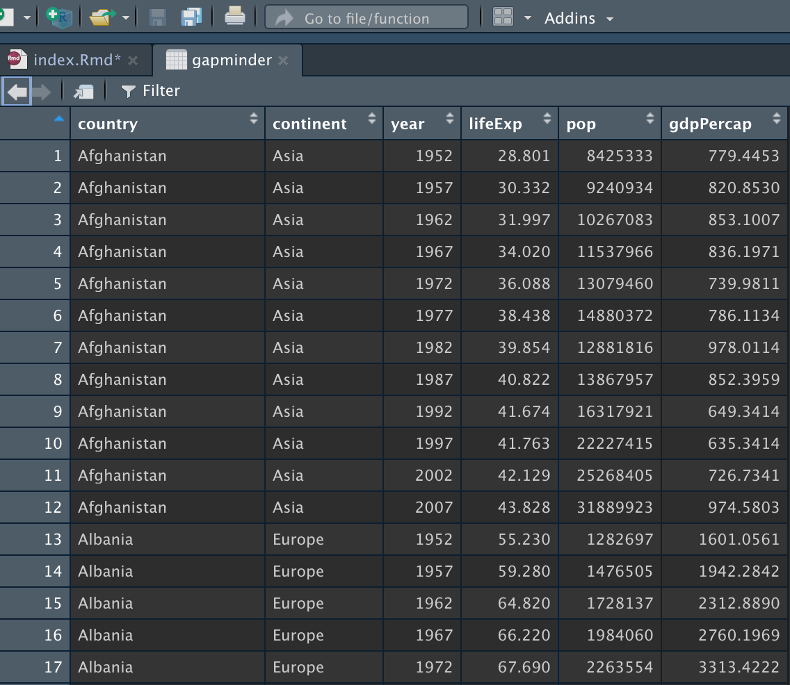

> 原文: https://www.miriamheiss.com/posts/graphing-with-ggplot/


ggplot() 函数对任何数据科学家都是必不可少的, ta是一种非常简单的绘图函数。刚开始接触可能看起来很难， 不过不要害怕，因为一旦学了基础知识，一切都会变得清晰！ 让我们开始！

ggplotly函数可以直接创建动态交互图标， 该函数内置于ggplot()中。 今天我们要绘制动态散点图


<br>

## 准备

导入本文要用到的包

```{r warning=F, message=F}
library(tidyverse) 
library(gapminder) #准备数据
library(MetBrewer) #配色包
library(plotly) #动态图
```

<br>


## quick-start

只要会ggplot，只增多一行代码即可绘制出动态图。鼠标悬浮处会显示一个黑色弹出框。
```{r}
library(plotly)
library(dplyr)
library(gapminder)

#选出2007年的数据
gapminder_2007 <- gapminder %>% 
  filter(year=="2007") %>% 
  dplyr::select(-year)

p <- ggplot(data = gapminder_2007, 
            mapping = aes(x=gdpPercap, 
                          y=lifeExp, 
                          size = pop)) +
  geom_point(alpha=0.7)

#将静态图转为动态图
ggplotly(p)
```


## 画布gglot

用ggplot函数构造一个画布, 使用gapminder数据集



- 将gdpPercap设定为x轴
- 将lifeExp设定为y轴

```{r}
ggplot(data = gapminder_2007,
       mapping = aes(x = gdpPercap,
                     y = lifeExp))
```


现在我们将开始添加高层次的图层，会显示越来越多的信息。

<br>

## 添加geom

现在添加geom层，该层是通过 `+` 构建在ggplot层之上。这里使用 `geom_ponit()` 绘制散点图，

```{r}
ggplot(data = gapminder_2007,
       mapping = aes(x = gdpPercap,
                     y = lifeExp))+
  geom_point() #透明度
```

生成的图仅仅是黑白图，为了美观，可以设置为更靓丽的颜色。


<br>

## aes(color)

二维空间显示三维信息，
- x轴 gdpPercap
- y轴 lifeExp
- color continent


```{r}
ggplot(data = gapminder_2007,
       mapping = aes(x = gdpPercap,     #gdp
                     y = lifeExp,       #预期寿命
                     color=continent))+ #大陆
  geom_point() 
```

现在可以清晰地看出哪些大陆更加富裕、更加健康, 要是配色再好看点就好了。


<br>

## 调整配色

在 [https://hidadeng.github.io/blog/2022-09-04-r-ggplot2-histogram/]中首次使用了MetBrewer配色包。

这里会用5个具有区分度的颜色，我们选择 ``Lakota`` 配色方案。同时，在图中绘制对应的人口规模，以size方式显示。

```{r}
ggplot(data = gapminder_2007,
       mapping = aes(x = gdpPercap,     #gdp
                     y = lifeExp,       #预期寿命
                     size = pop,        #人口
                     color=continent))+ #大陆
  geom_point()+                
  scale_color_manual(values=met.brewer("Lakota", 5))
```

为了让数据更加平滑，对x轴取对数


```{r}
ggplot(data = gapminder_2007,
       mapping = aes(x = gdpPercap,     #gdp
                     y = lifeExp,       #预期寿命
                     size = pop,        #人口
                     color=continent))+ #大陆
  geom_point()+                
  scale_color_manual(values = met.brewer("Lakota", 5))+
  scale_x_log10(breaks = c(400, 4000, 40000))
```

<br>

## 更换主题

使用 ``theme_bw`` 更改绘图的主题风格

```{r}
ggplot(data = gapminder_2007,
       mapping = aes(x = gdpPercap,     #gdp
                     y = lifeExp,       #预期寿命
                     size = pop,        #人口
                     color=continent))+ #大陆
  geom_point()+                
  scale_color_manual(values = met.brewer("Lakota", 5))+
  scale_x_log10(breaks = c(400, 4000, 40000))+
  theme_bw()
```

<br>

## 标签labs

```{r}
p2 <- ggplot(data = gapminder_2007,
       mapping = aes(x = gdpPercap,     #gdp
                     y = lifeExp,       #预期寿命
                     size = pop,        #人口
                     color=continent,   #大陆
                     text = country))+  #国家
  geom_point()+                #透明度
  scale_color_manual(values = met.brewer("Lakota", 5))+
  scale_x_log10(breaks = c(400, 4000, 40000))+
  theme_bw()+
  labs(title = "Gdp and Life Expectancy in 142 countries",
       subtitle = "Most of Africa is sick and poor,\nwhile Europe is thriving and rich",
       x = "Gdp Per Capita",
       y = "Life Expectancy",
       fill = "Continent",
       size = "Population")

p2
```

使用ggplotly将p2从静态图转为动态图， 鼠标悬浮处弹出圆圈对应的国家。

```{r}
ggplotly(p2, tooltip = "text")
```


<br>

## 广而告之

-   [长期征稿](https://hidadeng.github.io/blog/call_for_paper/)
-   [长期招募小伙伴](https://hidadeng.github.io/blog/we_need_you/)
-   [付费视频课 \| Python实证指标构建与文本分析](https://hidadeng.github.io/blog/management_python_course/)
