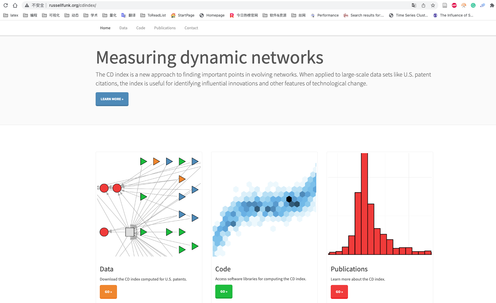
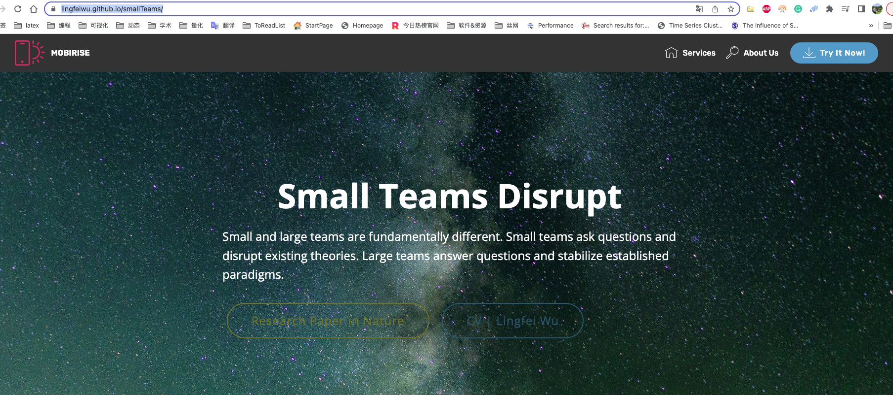

颠覆式创新是一个很火的概念，在创新创业、科学学等研究中，每个专利、论文的正文中都会引用关系，而引用关系会构成一个引用网络。

那么创新如何从网络形态进行区分，如何计算网络节点的创新程度，本文列举两篇与此相关的论文，分别是 Management science 和 Science 。


<br><br>

## 文献摘要

**Funk, Russell J., and Jason Owen-Smith. "A dynamic network measure of technological change." _Management science_ 63, no. 3 (2017): 791-817.**

该文使用网络分析方法研究技术变革，论文认为 **颠覆性的新发明，通过将发明者的注意力转移到或远离这些发明所依赖的知识，来重塑相互关联的技术网络。即更广的视野或更久远的视角，往往有利于颠覆性创新的产生**。**基于该思路，本文开发了新发明的颠覆性与否的计算指标cdindex**。我们将这些指标应用于大学研究商业化的分析，并发现 **联邦研究资金推动校园产生颠覆性创新，而商业联系会有利于巩固现状的创新**。通过量化新技术，我们提出的指数允许基于专利的创新研究捕捉概念上重要的现象， 这些现象无法通过既定措施检测到。该测量方法提供了支持创新、创业、技术战略、科学政策和社会网络理论研究的理论发展的经验见解。

>Abstract: This article outlines a network approach to the study of technological change. We propose that new inventions reshape networks of interlinked technologies by shifting inventors’ attention to or away from the knowledge on which those inventions build. Using this approach, we develop novel indexes of the extent to which a new invention consolidates or destabilizes existing technology streams. We apply these indexes in analyses of university research commercialization and find that, although federal research funding pushes campuses to create inventions that are more destabilizing, deeper commercial ties lead them to produce technologies that consolidate the status quo. By quantifying the effects that new technologies have on their predecessors, the indexes we propose allow patent-based studies of innovation to capture conceptually important phenomena that are not detectable with established measures. The measurement approach presented here offers empirical insights that support theoretical development in studies of innovation, entrepreneurship, technology strategy, science policy, and social network theory.


<br>

**Wu, Lingfei, Dashun Wang, and James A. Evans. "Large teams develop and small teams disrupt science and technology." Nature 566, no. 7744 (2019): 378-382.**

当今科学和技术最普遍的趋势之一是各个领域的大型团队的增长，因为孤独的研究人员和小型团队的流行程度正在减少 。团队规模的增加归因于科学活动的专业化、通信技术的改进 或需要跨学科解决方案的现代问题的复杂性。团队规模的这种转变引发了一个问题，即大团队所产生的科技特征是否以及如何不同于小团队。分析了 1954-2014 年期间超过 6500 万篇论文、专利和软件产品，证明在此期间，**较小的团队倾向于将拉长到更大的时间尺度，借鉴过去，用新的想法和机会来颠覆科学和技术；而较大的团队倾向于聚焦于当前流行的，完善当前现有的**。不论团队大小，均对于蓬勃发展的科学技术生态至关重要，并表明，为实现这一目标，科学政策应旨在支持团队规模的多样性。

>Abstract: One of the most universal trends in science and technology today is the growth of large teams in all areas, as solitary researchers and small teams diminish in prevalence. Increases in team size have been attributed to the specialization of scientific activities,
improvements in communication technology, or the complexity
of modern problems that require interdisciplinary solutions.This shift in team size raises the question of whether and how the character of the science and technology produced by large teams differs from that of small teams. Here we analyse more than 65 million papers, patents and software products that span the period 1954–2014, and demonstrate that across this period smaller teams have tended to disrupt science and technology with new ideas and opportunities, whereas larger teams have tended to develop existing ones. Work from larger teams builds on morerecent and popular developments, and attention to their work comes
immediately. By contrast, contributions by smaller teams search more deeply into the past, are viewed as disruptive to science and technology and succeed further into the future—if at all. Observed differences between small and large teams are magnified for higherimpact work, with small teams known for disruptive work and large teams for developing work. Differences in topic and research design
account for a small part of the relationship between team size and disruption; most of the effect occurs at the level of the individual, as people move between smaller and larger teams. These results demonstrate that both small and large teams are essential to a flourishing ecology of science and technology, and suggest that, to achieve this, science policies should aim to support a diversity of team sizes.


<br><br>

## 算法对比
我没阅读两篇论文，仅就颠覆性与否的计算方法和图例，感觉算法实现差不多。


<br>


<br><br>

## 代码数据
下面分别为Management2017和Nature2019的主页，均含数据和代码。

[](http://russellfunk.org/cdindex/)

<br>

[](https://lingfeiwu.github.io/smallTeams/)


<br><br>


## 算法实现

按照时间优先原则，本文就只分享Management2017论文作者Funk, Russell开源了cdindex库 (开发语言C和Python) ，安装


<br>

```
pip3 install cdindex
```


将Management2017 cdindex算法图 标注为如下图， 下图中左右两个网络节点是相同的，只需构造一套节点，两套边数据即可完成实验。


<br>

我们就直接上代码


```{python}
import cdindex
import datetime

#节点，理解为专利号或者论文doi号；同时节点有先后时间属性
vertices = [{"name": "x1", "time": datetime.datetime(1990, 1, 1)},
           {"name": "x2", "time": datetime.datetime(1990, 1, 1)},
           {"name": "x3", "time": datetime.datetime(1990, 1, 1)},
           {"name": "x4", "time": datetime.datetime(1990, 1, 1)},
        
           {"name": "y", "time": datetime.datetime(1991, 1, 1)},
          
           {"name": "z1", "time": datetime.datetime(1995, 1, 1)},
           {"name": "z2", "time": datetime.datetime(1995, 1, 1)},
           {"name": "z3", "time": datetime.datetime(1995, 1, 1)},
           {"name": "z4", "time": datetime.datetime(1995, 1, 1)},
           {"name": "z5", "time": datetime.datetime(1995, 1, 1)},
           {"name": "z6", "time": datetime.datetime(1995, 1, 1)}]
           
    
#edges_1边关系
#edges_1中的y为颠覆型
edges_1 = [{"source": "z1", "target": "y"},
           {"source": "z2", "target": "y"},
           {"source": "z3", "target": "y"},
           {"source": "z4", "target": "y"},
           {"source": "z5", "target": "y"},
           {"source": "z6", "target": "y"},
           
           {"source": "y", "target": "x1"},
           {"source": "y", "target": "x2"},
           {"source": "y", "target": "x3"},
           {"source": "y", "target": "x4"}]


#edges_2边关系 
#edges_2中的y为巩固型
edges_2 = [{"source": "z1", "target": "y"},
           {"source": "z2", "target": "y"},
           {"source": "z3", "target": "y"},
           {"source": "z4", "target": "y"},
           {"source": "z5", "target": "y"},
           {"source": "z6", "target": "y"},
           
           {"source": "y", "target": "x1"},
           {"source": "y", "target": "x2"},
           {"source": "y", "target": "x3"},
           {"source": "y", "target": "x4"},
          
          {"source": "z1", "target": "x1"},
          {"source": "z2", "target": "x1"},
          {"source": "z3", "target": "x2"},
           
          {"source": "z4", "target": "x3"},
          {"source": "z5", "target": "x3"},
          {"source": "z5", "target": "x4"},
          {"source": "z6", "target": "x4"}]


# 构建两个网络
graph1 = cdindex.Graph() #颠覆型
graph2 = cdindex.Graph() #发展型

# 添加节点
for vertex in vertices:
    graph1.add_vertex(vertex["name"], cdindex.timestamp_from_datetime(vertex["time"]))
    graph2.add_vertex(vertex["name"], cdindex.timestamp_from_datetime(vertex["time"]))

# 添加引用关系
for edge in edges_1:
    graph1.add_edge(edge["source"], edge["target"])
for edge in edges_2:
    graph2.add_edge(edge["source"], edge["target"])
    
    
#y研究发布后1825天内，引用y的论文(专利)列入网络。
t_delta = int(datetime.timedelta(days=1825).total_seconds())

#计算cdindex得分
score1 = graph1.cdindex("y", t_delta)
score2 = graph2.cdindex("y", t_delta)

print('左侧-网络中的y节点的cdinex得分: {}, 节点y 为颠覆型创新'.format(score1))
```

<br>

```{python}
print('右侧-网络中的y节点的cdinex得分: {}, 节点y 为巩固型创新'.format(score2))
```


<br><br>

## cdindex
对比Python的结果，与论文计算过程，完全一致。cdindex内部实现我不太熟悉，如果想了解cdindex内部实现，可前往 [cdindex仓库地址](https://github.com/russellfunk/cdindex) 阅读源码。


<br><br>

## 广而告之

-   [长期征稿](https://textdata.cn/blog/call_for_paper/)
-   [长期招募小伙伴](https://textdata.cn/blog/we_need_you/)
-   [付费视频课 \| Python实证指标构建与文本分析](https://textdata.cn/blog/management_python_course/)
