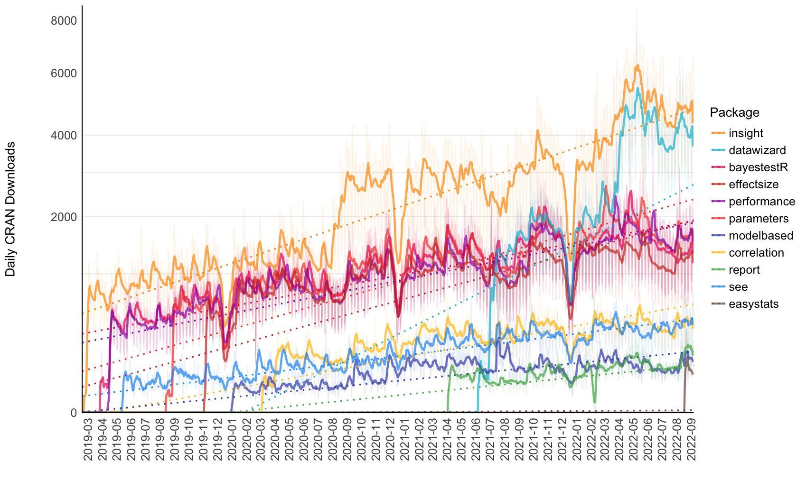

[easystats](https://easystats.github.io/easystats/index.html) 是 R 包集合，可提供统一且easy的代码进行 统计分析。

<br>

## 与 tidyverse 有何不同？

tidyverse包集合，是 R语言 中非常流行的软件包集合（ggplot、dplyr、tidyr......），它也使 R 的使用更加容易。那么，您应该选择 tidyverse 还是 easystats？

**两个都选！**

事实上，这两个生态系统的设计考虑了非常不同的目标。 tidyverse 包主要用于 `数据操作和探索`。而 easystats 更关注分析的最后阶段：`理解和解释您的结果，并在手稿或报告中报告它们`。您绝对可以在 tidyverse 工作流程中使用 easystats 功能！

easystats + tidyverse = ❤️

<br>

## easystats生态圈

每个 easystats 包都有不同的范围和用途。这意味着您最好的开始方式是探索并选择您认为可能对您有用的那些。但是，由于它们的构建考虑了"更大的图景"，您会意识到使用更多它们会创建一个流畅的工作流程，因为这些包旨在协同工作。理想情况下，这些软件包可以协同工作，涵盖统计分析和数据可视化的所有方面。

-   [report](https://easystats.github.io/report/)：📜 🎉 生成自动统计报告
-   [correlation](https://easystats.github.io/correlation/)：🔗 相关性的多合一包
-   [modelbased](https://easystats.github.io/modelbased/)：📈 基于统计模型估计效果、组平均值和组间对比
-   [bayestestR](https://easystats.github.io/bayestestR/)：👻 非常适合贝叶斯统计的初学者或专家
-   [effectize](https://easystats.github.io/effectsize/): 🐉 计算、转换、解释和使用效果大小和标准化参数的索引
-   [see](https://easystats.github.io/see/) ：🎨 创建漂亮结果可视化的绘图
-   [parameters](https://easystats.github.io/parameters/)：📊 获取有关模型包含参数所有信息的表格
-   [performance](https://easystats.github.io/performance/)：💪模型的质量和性能指标（R2、ICC、LOO、AIC、BF、...）
-   [insight](https://easystats.github.io/insight/)：🔮 对于开发人员来说，一个包可以帮助您使用不同的模型和包
-   [datawizard](https://easystats.github.io/datawizard/)：🧙 清理和转换数据的魔法药水

截止2022-09-21， easystats生态中各个包的下载情况

| Total      | insight   | bayestestR | parameters | performance | datawizard | effectsize | correlation | see     | modelbased | report | easystats |
|:-----------|:----------|:-----------|:-----------|:------------|:-----------|:-----------|:------------|:--------|:-----------|:-------|:----------|
| 10,001,095 | 3,085,739 | 1,373,379  | 1,363,678  | 1,285,506   | 1,159,097  | 1,060,079  | 277,541     | 251,038 | 94,089     | 48,876 | 2,073     |



<br>

## 安装

```{r eval=FALSE}
install.packages("easystats")
```

<br>

## 炫一下
easystats到底如何好用，今天只实验report包，该包号称 “从 R 到你的手稿”

报告的主要目标是弥合 R 的输出与手稿中包含的格式化结果之间的差距。 它根据最佳实践指南（例如 APA 期刊风格）自动生成模型和数据框架的报告，确保结果报告的标准化和质量。


生成iris数据集描述性统计信息的英文报告

```{r}
report(iris)
```

<br>

生成线性回归模型的报告

```{r}
library(report)

model <- lm(Sepal.Length ~ Species, data = iris)
report(model)
```

更多内容请阅读 [report包](https://easystats.github.io/report/) 的文档。

<br>

## 广而告之

-   [长期征稿](https://hidadeng.github.io/blog/call_for_paper/)
-   [长期招募小伙伴](https://hidadeng.github.io/blog/we_need_you/)
-   [付费视频课 \| Python实证指标构建与文本分析](https://hidadeng.github.io/blog/management_python_course/)

