```{r xaringan-tile-view, echo=FALSE}
xaringanExtra::use_tile_view()
```

```{r setup, include=FALSE}
options(htmltools.dir.version = FALSE)
knitr::opts_chunk$set(
  fig.width=9, fig.height=3.5, fig.retina=3,
  out.width = "100%",
  cache = FALSE,
  echo = TRUE,
  message = FALSE, 
  warning = FALSE,
  hiline = TRUE
)
```

```{r xaringan-themer, include=FALSE, warning=FALSE}
library(xaringanthemer)
style_duo_accent(
  primary_color = "#1381B0",
  secondary_color = "#FF961C",
  inverse_header_color = "#FFFFFF"
)
```


```{r xaringan-editable, echo=FALSE}
#可编辑
xaringanExtra::use_editable(expires = 1)
```

```{r xaringan-scribble, echo=FALSE}
#可涂鸦
xaringanExtra::use_scribble()
```


```{r xaringan-logo, echo=FALSE}
xaringanExtra::use_logo(image_url = "img/哈工大.png")
```

```{r xaringan-webcam, include = FALSE}
xaringanExtra::use_webcam()
```


## 认识文本

“**语言的界限就是思想的界限**” -维根特斯坦


<center></center>

--


<center>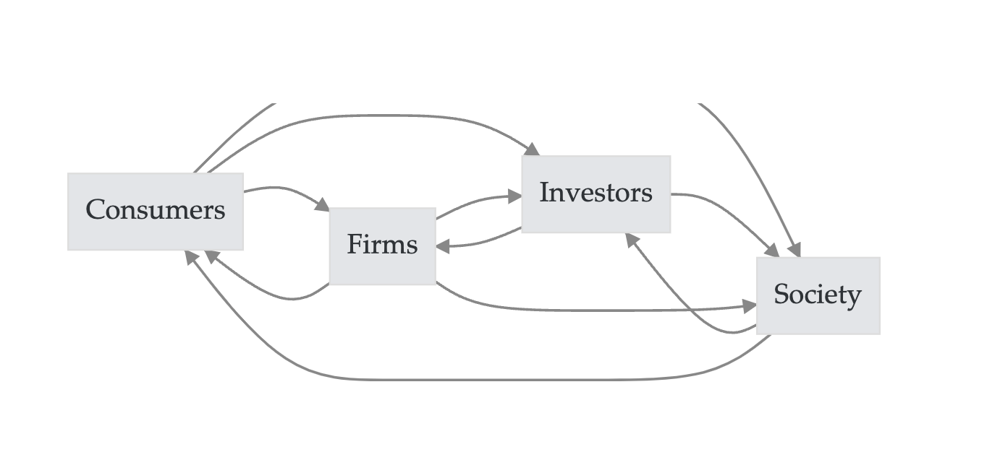</center>


---

## 认识文本

                            
斯图亚特·霍尔在《电视话语的编码和解码》提出 **编码-解码理论**

<center>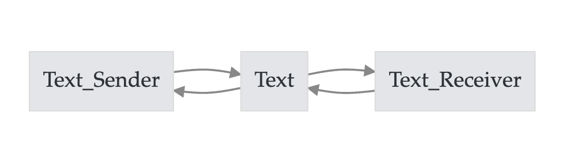</center>

--

- How text reflects its sender？
- How text impacts its receiver？

--

使用文本做研究，首先需要明确三个

- 角色: **Sender** or **Receiver**
- 方向: **Reflect** or **Impact**
- 内容: Sender的信息(认知、偏好、...)   vs  Receiver的信息(认知、偏好、...)

---

.left-column[

## 认识文本

Berger, Jonah, Ashlee Humphreys, Stephan Ludwig, Wendy W. Moe, Oded Netzer, and David A. Schweidel. "[**<font color='blue'>Uniting the tribes: Using text for marketing insight.</font>**](https://textdata.cn/blog/text_mining_in_marketing_research/)" Journal of Marketing 84, no. 1 (2020): 1-25.
]

.right-column[
<center>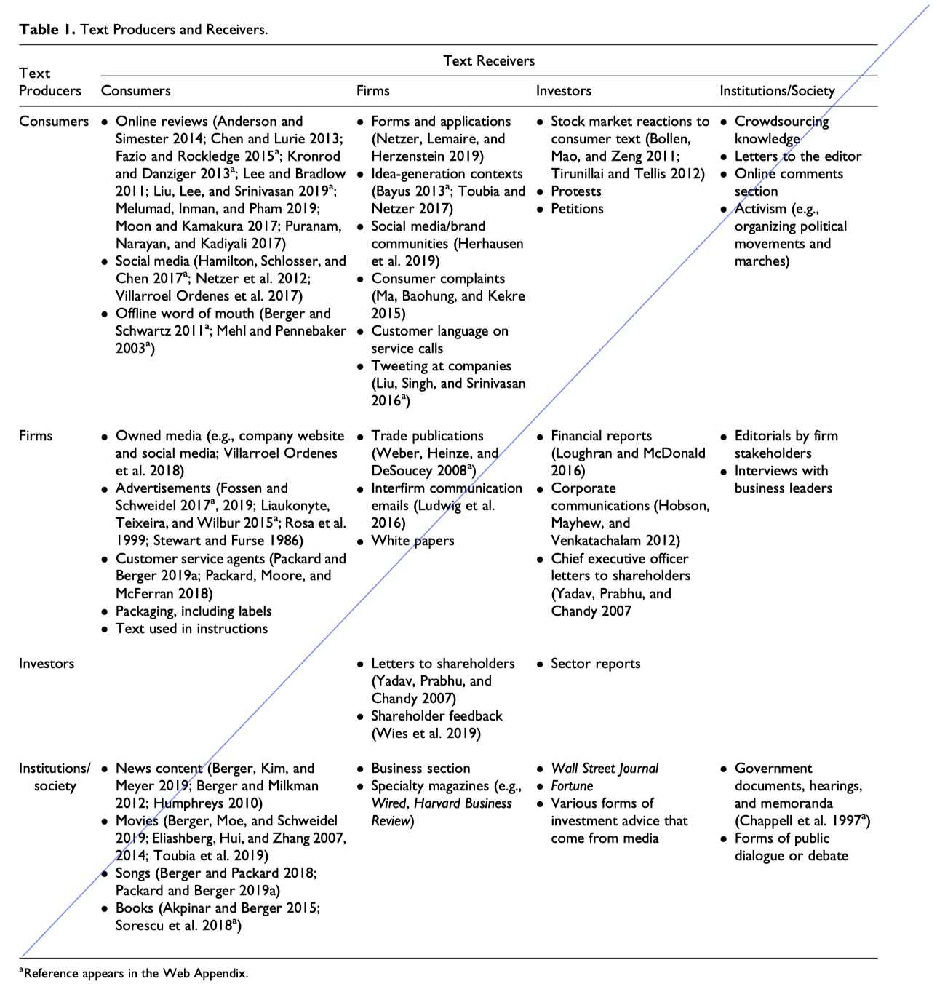</center>
]


---

## 人工编码与机器编码

<center>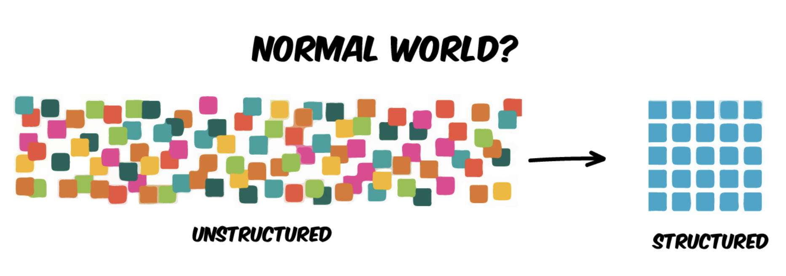</center>

--

|                              | 分析方法                                               | 优点                                                         | 缺点                                             |
| :---------------------------------- | ------------------------------------------------------ | ------------------------------------------------------------ | ------------------------------------------------ |
| 人工编码        | 质性（扎根）                                           | 少量数据，深刻洞见。           | 难以应对大数据；<br>编码标准不统一； |
| 机器编码| 词频、向量相似度、向量距离 | 适合大规模文本挖掘<br>编码标准是统一的; | 需要破坏文本的结构，<br>丧失了部分信息量             |

---


## 机器编码-将文本转为数字或向量


- **符号法**(每个词对应一个数字)

   - **词典法**
   - **词袋法Bag of-words、TF-IDF** 

- **词嵌入**

   - Word2Vec
   - GloVe
   - Fasttext

---

## 符号法


.left-column[

### 算法
 - 词典法
 - 词袋法(或TF-IDF)
 
### 工具
 - Python、R编程语言
 - [<font color='blue'>LIWC(Linguistic Inquiry and Word Count)</font>](https://textdata.cn/blog/liwc_python_text_mining/)
 - ...
 
 ]

.right-column[
<center></center>
]


---

## 符号法的应用

| 概念指标   |  测量方法     |
| ---------------------- | ------------------------------------------------------------ |
| 认真(努力)        | 测量文本中词语的个数                                         |
| 情感               | 使用情感词典，统计文本中正面词占比                           |
| 可读性             | 文本中高难度(或专业性)词占比                                 |
| 客观性             | 文本中某个值的方差，如情感<br>- A``产品不错， 包装破损， 态度很好， 综合还是推荐大家购买!`` [5, 1, 5, 4]<br>- B``产品垃圾，使用垃圾， 包装破损， 差评!!`` [1,  1,  1,  1]<br>A的方差更大，更客观 |
|[<font color='blue'>具体性</font>](https://textdata.cn/blog/jcr_concreteness_computation/)| 使用具体性词典， 将文本中出现的具体词权重累加，除以总词数，求得具体性得分|
| 短视主义 |统计短视相关词在年报管理层讨论与分析中出现的占比|
| [<font color='blue'>相似性(政策稳定性)</font>](https://textdata.cn/blog/2023-01-10-similarity_of_cental_bank_monetary_policy/) | cosine(text_vector1, text_vector2)       |
| ...                    | ...                          |

---

## 词嵌入

词嵌入技术有 Word2Vec、[<font color='blue'>GloVe</font>](https://nlp.stanford.edu/projects/glove/)、FastText。

在n维语义空间中，词语的语义以 **分布式** 的 **向量** 形式存在。

--

<center>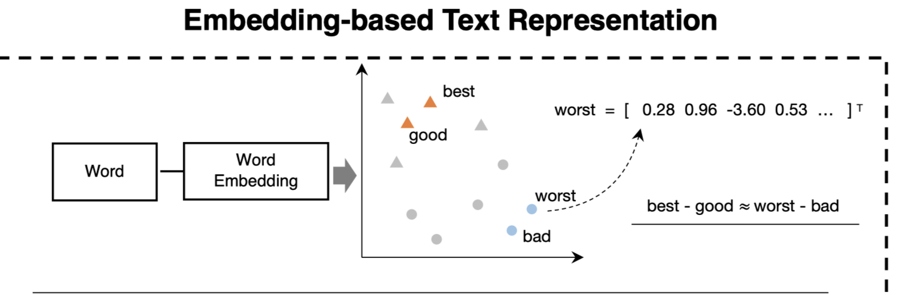</center>


---

## 词嵌入中的语义关系


.left-column[

King-Queen≈Man-Woman

]

.right-column[
<center>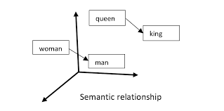</center>
]


---

## 词嵌入中的语义关系


<center>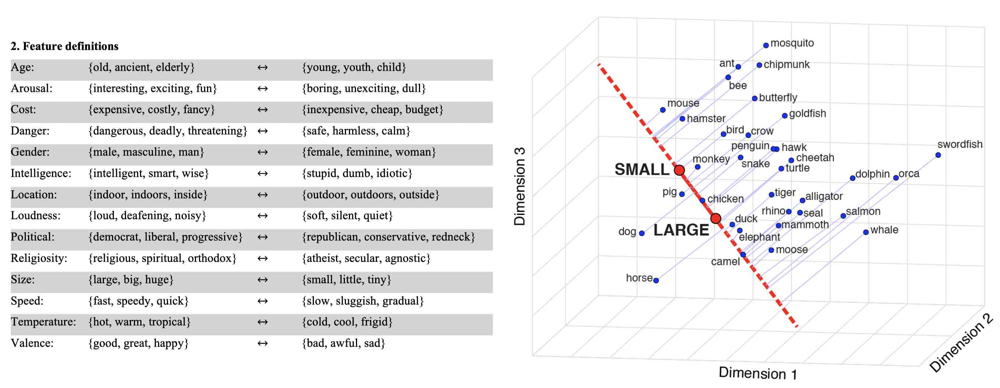</center>

Grand, G., Blank, I.A., Pereira, F. and Fedorenko, E., 2022. Semantic projection recovers rich human knowledge of multiple object features from word embeddings. Nature Human Behaviour, pp.1-13.


---

## 词嵌入的应用

| 概念指标   |  测量方法     |
| ---------------------- | ------------------------------------------------------------ |
| [<font color='blue'>创新力(发散思维)得分</font>](https://textdata.cn/blog/2022-11-14-pnas_naming_unrelated_words_predicts_creativity/)     |语义距离； 计算词语之间语义距离; pnas2021 |
| [<font color='blue'>团队认知差异性</font>](https://textdata.cn/blog/2023-11-02-measure-cognitive-diversity-through-language-discursive-diversity/)|语义距离； 一定时期内， 团队在线沟通过程中，使用的语言的差异性测量|
|[<font color='blue'>社会偏见(刻板印象)</font>](https://textdata.cn/blog/wordembeddingsinsocialscience/#31-社会偏见刻板印象)|语义距离；相比“男性”词汇，人们更少将“女性”词汇和“能力/ 成功/热情”等具有积极属性的词汇相关联。|
|[<font color='blue'>语义变迁</font>](https://textdata.cn/blog/wordembeddingsinsocialscience/#33-语义内涵演变)|语义位置； “gay”作为一个多义词，在 1900 年代的文本中和“cheerful(开心)”和“frolicsome(玩闹)”词义更接近，而到 1990 年代则与“homosexual(同性恋)”、“lesbian(女性同性恋)”等更接近。|
|...|...|

--

相关资料
- [<font color='blue'>大数据时代下社会科学研究方法的拓展——基于词嵌入技术的文本分析的应用</font>](https://textdata.cn/blog/wordembeddingsinsocialscience/)
- [<font color='blue'>概念空间 | 词嵌入模型如何为组织科学中的测量和理论提供信息</font>](https://textdata.cn/blog/2023-11-03-organization-science-with-word-embeddings/)
- [<font color='blue'>词嵌入技术在社会科学领域进行数据挖掘常见39个FAQ汇总</font>](https://textdata.cn/blog/2023-03-15-39faq-about-word-embeddings-for-social-science/)

---

## 机器编码总结


| 机器编码方式 | 计算方法                          | 维度类比         | 任务                                               | 例子                                                         |
| ------------------ | --------------------------------- | ---------------- | -------------------------------------------------- | ------------------------------------------------------------ |
| **符号法-字典**（词频） | 数个数                            | 原子             | 统计每句话里的名词个数                             | sent_num1 = 2<br>sent_num2 = 1                               |
| **符号法-词袋**         | bag of words<br>one-hot<br>Tf-idf | 分子             | 转化为词向量, 计算两个句子相似度。                 | vec1 = [1, 1, 1, 1, 1, 0]<br>vec2 = [0, 1, 0, 1, 0, 1]<br>similarity = cosine(vec1, vec2) |
| **词嵌入**         | word2vec、<br>glove等             | 中子、质子、电子 | 词语相似度。(语义上大小相近，方向相反; 态度、偏见) | mom = [0.2, 0.7, 0.1]<br/>dad   = [0.3, 0.5, -0.2]           |


---

| 文献                                                         | 定性 | 词频 | 词袋 | W2V建词典 | W2V认知变迁 |
| ------------------------------------------------------------ | ---- | ---- | ---- | --------- | ----------- |
| 王伟, 陈伟, 祝效国 and 王洪伟, 2016. 众筹融资成功率与语言风格的说服性--基于 Kickstarter 的实证研究. *管理世界*, (5), pp.81-98. | Y    | Y    |      |           |             |
| [<font color='blue'>语言具体性如何影响顾客满意度</font>](https://textdata.cn/blog/jcr_concreteness_computation/)<br>Packard, Grant, and Jonah Berger. “How concrete language shapes customer satisfaction.” *Journal of Consumer Research* 47, no. 5 (2021): 787-806. |      | Y    |      |           |             |
| Wang, Quan, Beibei Li, and Param Vir Singh. "Copycats vs. original mobile apps: A machine learning copycat-detection method and empirical analysis." Information Systems Research 29, no. 2 (2018): 273-291. |      |      | Y    |           |             |
| [<font color='blue'>文本相似度</font>](https://textdata.cn/blog/2019-12-08-lazy-prices/)<br>Cohen, L., Malloy, C. and Nguyen, Q., 2020. Lazy prices. *The Journal of Finance*, *75*(3), pp.1371-1415. |      |      | Y    |           |             |
| 胡楠,薛付婧,王昊楠. **管理者短视主义**影响企业长期投资吗？——基于文本分析和机器学习[J].管理世界,2021,37(05):139-156+11+19-21. |      |      | Y    | Y         |             |
| [<font color='blue'>计算团队的话语多样性衡量团队的认知多样性</font>](https://textdata.cn/blog/2023-11-02-measure-cognitive-diversity-through-language-discursive-diversity/)<br>Lix, Katharina, Amir Goldberg, Sameer B. Srivastava, and Melissa A. Valentine. “Aligning differences: Discursive diversity and team performance.” Management Science 68, no. 11 (2022): 8430-8448. |      |      |      |           | Y           |

---

.left-column[
## 案例1-众筹语言风格

王伟, 陈伟, 祝效国 and 王洪伟, 2016. 众筹融资成功率与语言风格的说服性--基于 Kickstarter 的实证研究. *管理世界*, (5), pp.81-98. 

扎根发现风格; 共现法近义词法扩展词典
]

.right-column[
<center>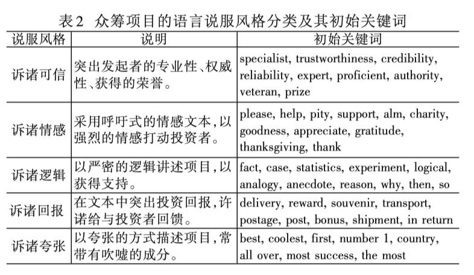</center>

<center>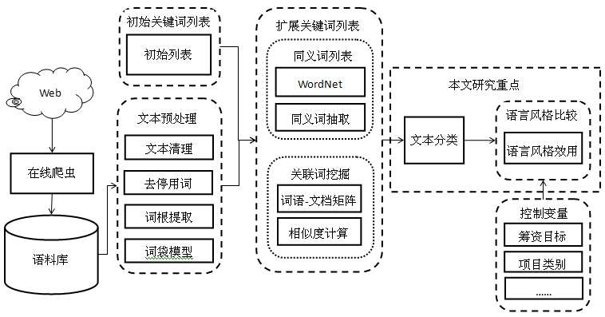</center>
]

---


.left-column[
## 案例2-Lazy prices文本相似性


Cohen, L., Malloy, C. and Nguyen, Q., 2020. [<font color='blue'>Lazy prices</font>](https://textdata.cn/blog/2019-12-08-lazy-prices/). *The Journal of Finance*, *75*(3), pp.1371-1415. 

文档向量化;

**cosine**(prev_report_vec, after_report_vec)
]

.right-column[
<center>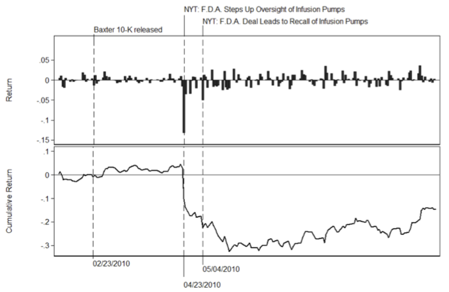</center>

<center>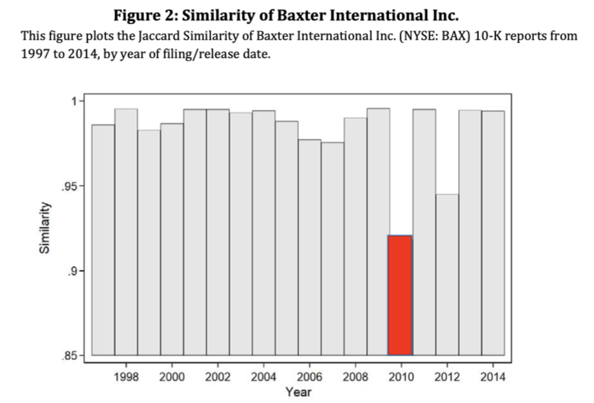</center>
]


---


.left-column[
## 案例3-山寨 vs 原创


Wang, Quan, Beibei Li, and Param Vir Singh. "Copycats vs. original mobile apps: A machine learning copycat-detection method and empirical analysis." Information Systems Research 29, no. 2 (2018): 273-291.

文档向量化， Kmeans聚类

]

.right-column[
<center>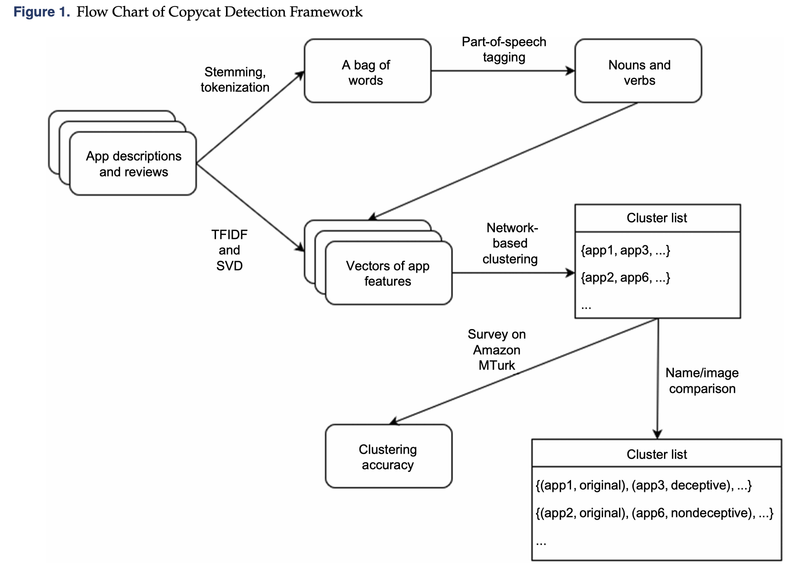</center>


]


---


class: center, middle

# Thanks!

[**https://textdata.cn/**](https://textdata.cn/)

**公众号: 大邓和他的Python**


