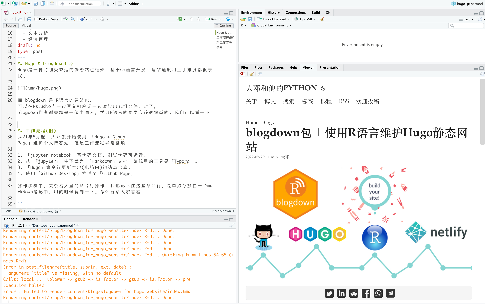
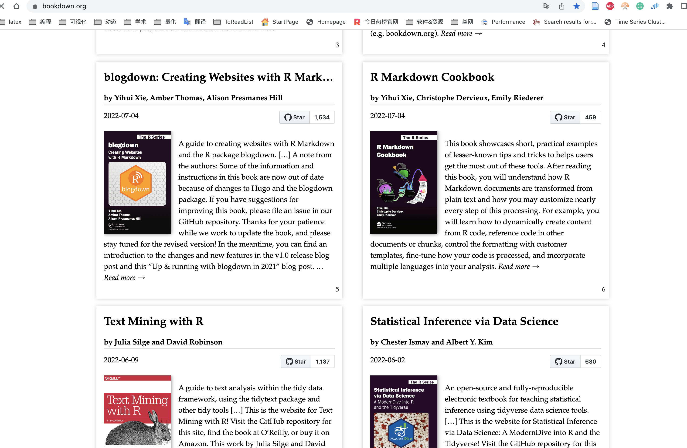
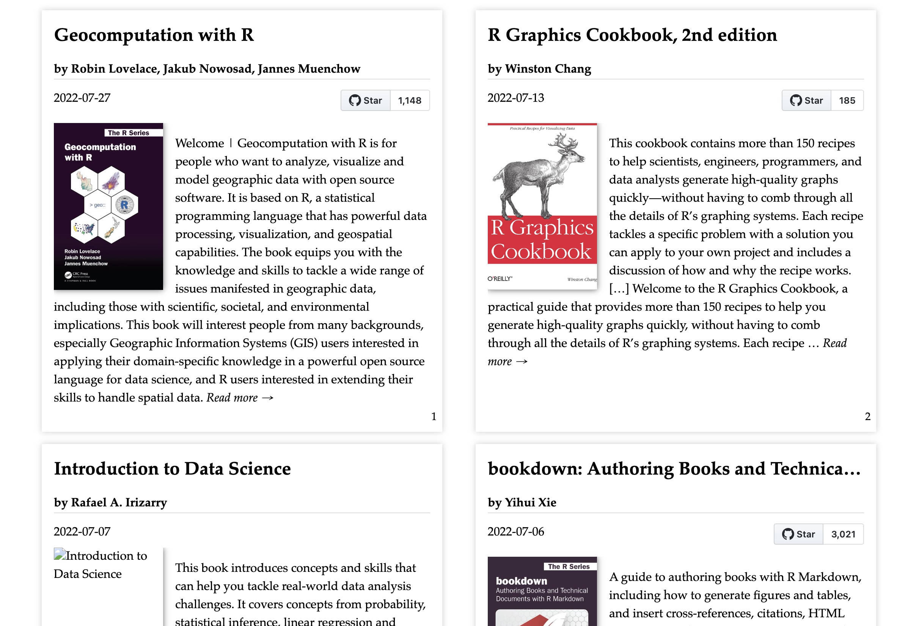

## Hugo

Hugo是一种特别受欢迎的静态站点框架，基于Go语言开发，建站速度和上手难度都很亲民。


<br><br>

## Blogdown
而 blogdown 是 R语言的建站包， 可以在Rstudio内一边写文档笔记一边渲染出html文件。下图是Rstudio 截图



- **Rstudio左上角** 为博客文档撰写区(代码、文档、图片)
- **Rstudio左下方** 为命令行区域
- **Rstudio右下方** 为博客文档渲染效果

<br>

对了， blogdown作者 [谢益辉](https://yihui.org/en/) 是一位中国人，他同时也是 [bookdown](https://bookdown.org/)、 [tinytex](https://yihui.org/tinytex/) 等包的作者。 学习R语言的同学应该很熟悉的。目前很多 R语言 优秀的文档都是使用 bookdown包，比如





<br><br>

## 工作流程(旧)


从21年5月起，大邓第一次使用 [Hugo + Gihub Page](https://hidadeng.github.io/blog/hugo_website_test/) 建立个人博客站，之后又更换为 [hugo-papermod主题；新增留言功能](https://hidadeng.github.io/blog/blog_add_comments_function/)。界面美观，代码复制很方便，适合公众号关注者浏览学习。但对大邓而言，工作流程异常繁琐

1.  **jupyter notebook** 写代码文档，测试代码可运行。
2.  从 **jupyter** 中下载为 **markdown** 文档，编辑用的工具是**Typora**。
3.  **Hugo**命令行更新本地(电脑内)的站点仓库。
4.  使用 **Github Desktop** 推送至**Github Page**

操作步骤中，夹杂着大量的命令行操作，我也记不住这些命令行，是单独存放在一个markdown笔记中，用的时候复制一下。命令行给大家看看

    #切换至电脑博客仓库
    cd /Users/大邓/Desktop/Blog/Github

    #启动本地服务，浏览器测试
    hugo server -t PaperMod --buildDrafts

    #生成站点，待推送至github
    hugo --theme=PaperMod --baseUrl='/' --buildDrafts


<br>

总之就是复杂，最近用 R语言 发现有 **blogdown**包 可以将其中的步骤压缩， 主要工作集中在 **Rstudio** 和 **Github Desktop**。


<br><br>

## 新工作流程

1.  在 **Rstudio** 内新建 **Rmarkdown** 文档，内部可进行 R语言(或Python) 的代码撰写
2.  编译 **Rmarkdown文档** 为 html， **Github Desktop** 推送至仓库，更新站点。

需要用到的命令，仅仅有以下4个

```
    #新建博客 .Rmd文件
    blogdown::new_post()

    #启动本地服务，一遍写文档，网页渲染效果随时可见
    blogdown::serve_site()

    #停止本地服务
    blogdown::stop_server()

    #将.Rmd文件渲染为html等站点文件
    blogdown::build_site()
```

<br><br>

## 本文参考资料
-   [blogdown Docs](https://bookdown.org/yihui/blogdown/)
-   [Hugo-PaperMod](https://themes.gohugo.io/themes/hugo-papermod/)
-   [用 R 语言的 blogdown+hugo+netlify+github 建博客](https://cosx.org/2018/01/build-blog-with-blogdown-hugo-netlify-github/)


<br>


## 长期征稿




<br>


## 招募小伙伴



<br>


## 了解课程



[点击进入详情页](https://hidadeng.github.io/blog/management_python_course/)


