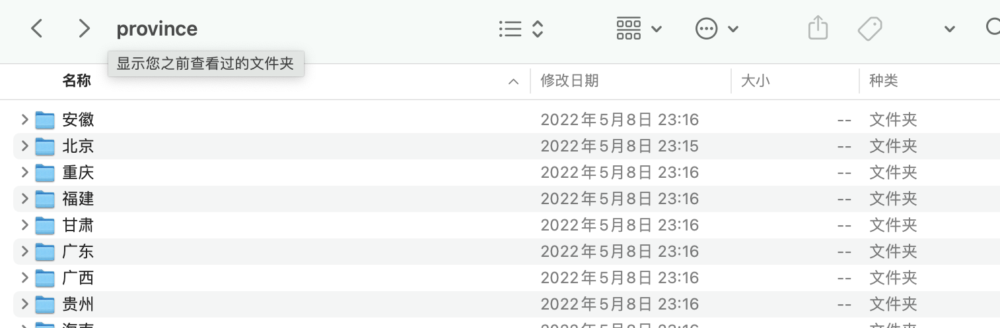
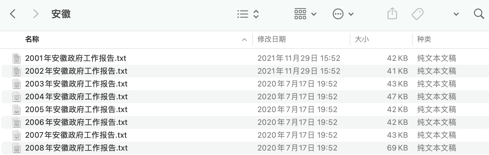

## 任务

使用R语言，对多个文件夹内的数百个txt汇总到一个csv文件内。

<br><br>

## 数据集

01-21年，全国各地市政府工作报告数据集。





<br><br>

## 任务分解

1.  使用list.files获取文件路径列表
2.  定义需要的函数
    -   使用readtext::readtext()函数读取报告文本
    -   年份函数、省份函数
3.  对每个文件路径，根据2得到三个字段信息，构造tibble结构；
4.  步骤2和步骤3使用bind_cols合并成一个tibble
5.  readr::write_csv()函数存至data.csv
6.  审查data.csv

数据存在province文件内, 该[**点击下载该数据集**](province.zip)

### 1. txt路径列表

使用 list.files函数查看

-   文件夹路径列表
-   文件路径列表

province内的文件夹路径列表

```{r}
dirs <- list.files('province', full.names = TRUE)
head(dirs)
```

所有省份文件夹内的文件路径列表

```{r}
files <- list.files(dirs, full.names = TRUE)
head(files)
```

共有617个txt文件

```{r}
length(files)
```

<br>

### 2.1 readtext读取txt

使用 readtext::readtext 批量读取 多个txt

```{r}
txts_df <- readtext::readtext(files)
head(txts_df)
```

检查text字段长度，是否为617.

```{r}
length(txts_df[['text']])
```

<br>

### 2.2 定义功能函数

数据整理到一个csv，我们想保存四个字段，分别是

-   txt文件名
-   年份
-   省(市)名
-   工作报告内容

年份和省份需要通过定义函数实现\~

```{r}
s<-basename("province/上海/2003年上海政府工作报告.txt") 
substr(s, 1, 4)
```

```{r}
library(tidyverse)

year_func <- function(filepath){
  year <- filepath %>% 
    basename() %>% 
    substr(1, 4)
  return (year)
}

name_func <- function(file){
  file <- basename(file)
  name <- gsub('政府工作报告.txt', '', file) 
  name <- stringr::str_sub(name, start=6)
  return (name)
}

file <- "province/上海/2003年上海政府工作报告.txt"
year_func(file)
name_func(file)
```

txts_df 是一个特殊的tibble数据类型。 现在需要构造年份、省份函数，获取另外一个tibble。

```{r}
year_province_df <- tibble(
  year = year_func(txts_df$doc_id),
  province = lapply(txts_df$doc_id, name_func) %>% unlist()
  )

head(year_province_df)
```

<br>

### 4. 合并两个tibble

cbind_rows()合并两个tibble

```{r}
res_df <- bind_cols(year_province_df, txts_df)
head(res_df)
```

<br>

### 5. 存入csv

使用 write.table(x, file, sep) 写入data.csv

-   x 待存储数据对象
-   file csv文件路径
-   delim 分割符

```{r}
?readr::write_csv
```

```{r}
readr::write_csv(x=res_df, 
                 file='data.csv', 
                 col_names=T) 
```

<br>

### 6. 检查data.csv

尝试读取 [data.csv](data.csv)

```{r}
df <- readr::read_csv('data.csv')
head(df)
```
