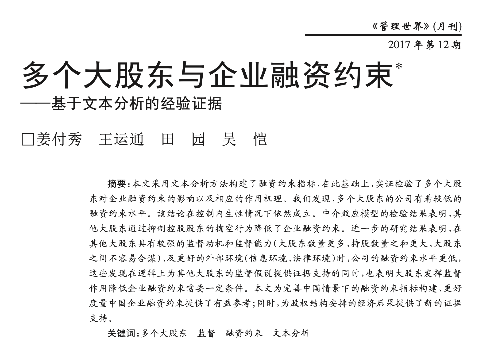

- [管理世界 | md&a数据中计算 「企业融资约束指标」](https://hidadeng.github.io/blog/2023-07-01-using-regex-to-compute-the-financial_constraints/)





<br><br>


## 一、识别融资约束样本
**在获取 MD&A 的基础上，采用正则表达式（Regular Expression） 检索出隐含融资约束信息的文本，并把相应的 MD&A 进行标记，纳入对应年度的融资约束文本集中**。 其中，在检索并标记融资约束文本的过程中，本文参考 Hoberg 和 Maksimovic （2015）、Buehlmaier 和 Whited（2016）的研究方法。 

Hoberg 和 Maksimovic（2015）认为，融资约束体现为**投资计划、项目的推迟、搁置乃至放弃**，因此，他们构造了两组“**推迟投资**”词语列表，一组是有推迟、延期、搁置含义的动词词表; 另一组是与投资、 项目、计划等意思相近的名词词表。 若在待识别文本中，动词词表和名词词表中的词语、词组同时出现，且相隔不超过 12 词，则将其判定为有推迟投资含义的融资约束文本。

Buehlmaier 和 Whited（2016） 在构建股权融资约束文本集的过程中，直接引用了前者的“推迟投资”词表，同时，为了确定投资的推迟确实是由股权融资方面的问题引起的，还计算了距“推迟投资”语句 12 词以内股权融资相关词语出现的频率，最终只把频率排行前 250 的观测加入股权融资约束文本集。

<br>

### 1.1 前人不足
需要说明的是，尽管本文采用的方法借鉴了 Hoberg 和 Maksimovic（2015）和 Buehlmaier 和 Whited （2016）的做法，但与其存在着两个方面的差异。 

- 第一，**本文没有通过“推迟投资”界定融资约束，而是通过公司对资金状况的描述去识别，相较而言这一做法更为直接**。 例如，若公司明确表明融资能力有限，资金紧张，则被视为融资约束样本。 
- 第二，**我们认为，即便“推迟投资”词表中的动词和名词在相隔 12 词以内出现，两个词之间也未必有关联，12词的窗口长度容易引起大量误判**。 尤其考虑到汉语使用较为灵活，不同公司在表述上也存在着较大的差异，因此，本文使用了可覆盖更多表述形式、更加灵活的正则表达式进行检索，并根据数次检索结果排除了很多容易导致误判的情形，查准率较高。

<br>

### 1.2 本文完善
具体地，为了在 MD&A 文本集中检索出融资约束文本，我们在设计正则表达式时将能显示公司有融资约束的各种文字表达，以词语组合的形式进行提炼。


```python
regex1 = "[^。]*?(融资|资金|筹资)[^。]{0, 6}?(难以|不能|无法|不足以)[^。]*"
#能在 MD&A 文本中匹配出以下形式的句子：（除句 号以外的任意长度字符串）+融资/资金/筹资+（六个 字符长度以内的任意字符串）+难以/不能/无法满足/不足以+（除句号以外的任意长度字符串）；

regex2 = "[^。]*?(融资|资金|筹资)[^。]{0, 6}?(成本|压力|难度)[^。]{0, 4}?(升|增|高|大)[^。]*"
#可在句号以外的任意长度字符串）+融资/资金/筹资+（六 个字符长度以内的任意字符串）+成本/压力/难度+ （4 个字符长度以内的任意字符串）+升/高/增/大+ （除句号以外的任意长度字符串）。
```

仅仅考虑融资约束文本的各种可能表述是不够的，会出现大量误判，例如，机械地将“资金”之后 4 个字符以内出现“不足”的语句识别为融资约束语句，非常容易 造成误判，因为部分 MD&A 提及公司“资金管理水平不足”，而资金管理水平反映的是公司运营能力， 和融资约束无直接关系。 诸如此类的匹配应视作误判而排除，因此我们利用正则表达式灵活的语法规则，同时构造了排除性条件。 **在此基础上，将这些对应着不同判断逻辑的“规则字符串”合并至同一个正则表达式中**。 如果难以合并，则利用程序语言的条件判断逻辑，对正则表达式组进行组合使用。 **在具体操作中，本文就使用了正则表达式组。**

<br><br>

## 二、 构建中文融资约束样本识别代码
**前面的样本识别都是论文原文，接下来是大邓对该论文的融资约束样本识别算法的复现**。 

### 2.1 融资约束文本的场景
这是一个相对复杂的需求，需要综合考虑多种情况， 对于每种情况，都构建一个单独的正则表达式，用于匹配对应的文本。可以使用“或”运算符， 合并为一个更大的正则表达式。 


```python
import re


#融资不足情况
regex1 = r"(?:融资|资金|筹资)[^。]{0,6}?(?:难以|不能|无法|不足以)[^。]*"
#融资成本或压力过大情况
regex2 = r"(?:融资|资金|筹资)[^。]{0,6}?(?:成本|压力|难度)[^。]{0,4}?(?:升|增|高|大)[^。]*"

#可以使用“或”运算符， 合并为一个更大的正则表达式
pattern = r"(" + regex1 + r")|(" + regex2 + r")"


#实验数据
text1 = "公司在过去几年中进行了大量的投资，导致资金短缺，难以支持公司未来的发展计划。"
text2 = "公司在过去几年中进行了大量的投资计划，资金状况良好，没有融资压力。"

#实验结果
matches1 = re.findall(pattern, text1)
print(matches1)
matches2 = re.findall(pattern, text2)
print(matches2)
```

    [('资金短缺，难以支持公司未来的发展计划', '')]
    []


在上面的例子中，pattern能识别出文本是否含有融资约束。

- text1**有融资约束**，所以返回带**有内容**的matches1
- text2**没有融资约束**，所以返回**没有内容**的matches2

<br>

### 2.2 识别中文融资约束样本的最终代码
前面的内容都是算法逐步实现的过程，现在咱们合并为一个函数代码


```python
import re

def is_financial_constraint_sample(text):
    #正则表达式组
    regex1 = r"(?:融资|资金|筹资)[^。]{0,6}?(?:难以|不能|无法|不足以)[^。]*"
    regex2 = r"(?:融资|资金|筹资)[^。]{0,6}?(?:成本|压力|难度)[^。]{0,4}?(?:升|增|高|大)[^。]*"
    pattern = r"(" + regex1 + r")|(" + regex2 + r")"
    
    #带内容的结果为融资约束，为True；反之，为False
    if len(re.findall(pattern, text))>=1:
        return True
    else:
        return False
    
    
#实验数据
text1 = "公司在过去几年中进行了大量的投资，导致资金短缺，难以支持公司未来的发展计划。"
text2 = "公司在过去几年中进行了大量的投资计划，资金状况良好，没有融资压力。"

#实验结果
print('text1文本是否为融资约束: ', is_financial_constraint_sample(text1))
print('text2文本是否为融资约束: ', is_financial_constraint_sample(text2))
```

    text1文本是否为融资约束:  True
    text2文本是否为融资约束:  False


<br><br>

## 三、批量识别融资约束样本


接下来对对md&a10-20.xlsx数据集所有md&a进行识别。


```python
import pandas as pd

# converters 强制声明该列为字符串，  防止股票代码 被程序识别为数字，

# 完整数据370+M 
df = pd.read_excel('mda10-20.xlsx', converters={'股票代码': str})
# df = pd.read_excel('small_mda_data.xlsx', converters={'股票代码': str})

#上市公司行业信息
ind_info_df = pd.read_excel('行业代码.xlsx', converters={'股票代码': str})
ind_info_df['板块'] = ind_info_df['股票代码'].apply(lambda code: '沪' if code[0]=='6' else ('深' if code[0]=='0' else '其他'))
ind_info_df = ind_info_df[ind_info_df['板块'].isin(['沪', '深'])]

#合并信息
df = pd.merge(df, ind_info_df, on=['股票代码', '会计年度'], how='inner')

#显示前5行
df.head()
```


<div>
<style scoped>
    .dataframe tbody tr th:only-of-type {
        vertical-align: middle;
    }

    .dataframe tbody tr th {
        vertical-align: top;
    }
    
    .dataframe thead th {
        text-align: right;
    }
</style>
<table border="1" class="dataframe">
  <thead>
    <tr style="text-align: right;">
      <th></th>
      <th>股票代码</th>
      <th>公司简称</th>
      <th>会计年度</th>
      <th>经营讨论与分析内容</th>
      <th>行业代码</th>
      <th>板块</th>
    </tr>
  </thead>
  <tbody>
    <tr>
      <th>0</th>
      <td>000001</td>
      <td>平安银行</td>
      <td>2010</td>
      <td>一、主营业务范围\n\n\n本行主营业务经营范围是经有关监管机构批准的各项商业银行业务，主要...</td>
      <td>J66</td>
      <td>深</td>
    </tr>
    <tr>
      <th>1</th>
      <td>000001</td>
      <td>平安银行</td>
      <td>2011</td>
      <td>一、2011 年度利润分配预案\n\n\n2011 年度本行法定财务报告（经境内注册会计师—...</td>
      <td>J66</td>
      <td>深</td>
    </tr>
    <tr>
      <th>2</th>
      <td>000001</td>
      <td>平安银行</td>
      <td>2012</td>
      <td>第四节 董事会报告\n\n一、2012 年经营情况分析\n\n（一）总体经营情况概述\n\n...</td>
      <td>J66</td>
      <td>深</td>
    </tr>
    <tr>
      <th>3</th>
      <td>000001</td>
      <td>平安银行</td>
      <td>2013</td>
      <td>第四节 董事会报告\n\n一、2013 年经营情况分析\n\n2013 年，国际经济呈缓慢复...</td>
      <td>J66</td>
      <td>深</td>
    </tr>
    <tr>
      <th>4</th>
      <td>000001</td>
      <td>平安银行</td>
      <td>2014</td>
      <td>一、2014 年经营情况分析\n（一）总体经营情况概述\n2014 年，国际环境复杂多变，国...</td>
      <td>J66</td>
      <td>深</td>
    </tr>
  </tbody>
</table>
</div>

<br>


```python
len(df)
```


    26132

<br>


```python
df['融资约束'] = df['经营讨论与分析内容'].apply(is_financial_constraint_sample)
df.head()
```


<div>
<style scoped>
    .dataframe tbody tr th:only-of-type {
        vertical-align: middle;
    }

    .dataframe tbody tr th {
        vertical-align: top;
    }
    
    .dataframe thead th {
        text-align: right;
    }
</style>
<table border="1" class="dataframe">
  <thead>
    <tr style="text-align: right;">
      <th></th>
      <th>股票代码</th>
      <th>公司简称</th>
      <th>会计年度</th>
      <th>经营讨论与分析内容</th>
      <th>行业代码</th>
      <th>板块</th>
      <th>融资约束</th>
    </tr>
  </thead>
  <tbody>
    <tr>
      <th>0</th>
      <td>000001</td>
      <td>平安银行</td>
      <td>2010</td>
      <td>一、主营业务范围\n\n\n本行主营业务经营范围是经有关监管机构批准的各项商业银行业务，主要...</td>
      <td>J66</td>
      <td>深</td>
      <td>False</td>
    </tr>
    <tr>
      <th>1</th>
      <td>000001</td>
      <td>平安银行</td>
      <td>2011</td>
      <td>一、2011 年度利润分配预案\n\n\n2011 年度本行法定财务报告（经境内注册会计师—...</td>
      <td>J66</td>
      <td>深</td>
      <td>False</td>
    </tr>
    <tr>
      <th>2</th>
      <td>000001</td>
      <td>平安银行</td>
      <td>2012</td>
      <td>第四节 董事会报告\n\n一、2012 年经营情况分析\n\n（一）总体经营情况概述\n\n...</td>
      <td>J66</td>
      <td>深</td>
      <td>True</td>
    </tr>
    <tr>
      <th>3</th>
      <td>000001</td>
      <td>平安银行</td>
      <td>2013</td>
      <td>第四节 董事会报告\n\n一、2013 年经营情况分析\n\n2013 年，国际经济呈缓慢复...</td>
      <td>J66</td>
      <td>深</td>
      <td>False</td>
    </tr>
    <tr>
      <th>4</th>
      <td>000001</td>
      <td>平安银行</td>
      <td>2014</td>
      <td>一、2014 年经营情况分析\n（一）总体经营情况概述\n2014 年，国际环境复杂多变，国...</td>
      <td>J66</td>
      <td>深</td>
      <td>True</td>
    </tr>
  </tbody>
</table>
</div>

<br>


```python
#融资约束样本占比
df['融资约束'].sum()/len(df)
```


    0.10332159804071636


### 注意
得到的is_financial_constraint应该是要检查， 检查的目的是改良正则表达式组， 这里假装我们检查完了，没什么问题。

<br><br>

## 四、构建融资约束指标
前面的融资约束样本识别，只是识别出融资约束是否存在，信息的颗粒度比较粗糙。**这篇论文使用文本相似度算法，构建了每家企业的融资约束指标**。

本文同样参照 Hoberg 和 Maksimovic（2015）的研究方法，我们认为，融资约束程度相近的公司，其在“管理层讨论与分析”中的用词和表述也会趋于一致。 因此，通过采用余弦相似度的方法，能够在识别出全体样本的融资约束程度，并以连续变量的形式进行呈现。


具体实现算法步骤

1. 给每个md&a文本转化为向量 ``Vec_it``
2. 当年所有属于融资约束样本的 ``Vec_it`` ， 求均值得到 ``ConstrainedVec_t``
3. 每家企业当年融资约束水平(程度) 由 ``Vec_it 与 ``ConstrainedVec_t`` 之积 , 即 ``ConstrainedScore_it`` 所体现。
4. 考虑到市场板块、行业性因素对融资约束的影响，不能直接使用 ``ConstrainedScore_it``。
   - 对历年隶属于各个板块的公司 MD&A，求标准化词频向量的均值并做标准化处理，记为 BoardVectb_bt ，该向量反映了上市板 b 在 t 年的共同性信息披露内容。
   - ``Vec_it`` 与对应板块 ``BoardVec_bt`` 之积，即为因 MD&A 共性内容导致的相似度， 记作 ``BoilerplateScore_i``。
   - 利用相同方法，计算出因行业特征引发的相似度，记作 ``IndustryScore_it`` 。
5. ``ConstrainedScore_it =β0 + β1 * BoardScore_bt + β2 * IndustryScore_it + E_it``

其中，残差 ``E_it``， 即为剔除了由上市交易所和行业特征引发融资约束后的融资约束相似度，也即本文最终采用的 **融资约束度量指标FC** 。

<br><br>

### 4.1 计算2020年的Vec_it
计算量太大，先以2020为例写代码。


```python
df_per_year = df[df['会计年度']==2020]
df_per_year.reset_index(inplace=True)
df_per_year.head()
```


<div>
<style scoped>
    .dataframe tbody tr th:only-of-type {
        vertical-align: middle;
    }

    .dataframe tbody tr th {
        vertical-align: top;
    }
    
    .dataframe thead th {
        text-align: right;
    }
</style>
<table border="1" class="dataframe">
  <thead>
    <tr style="text-align: right;">
      <th></th>
      <th>index</th>
      <th>股票代码</th>
      <th>公司简称</th>
      <th>会计年度</th>
      <th>经营讨论与分析内容</th>
      <th>行业代码</th>
      <th>板块</th>
      <th>融资约束</th>
    </tr>
  </thead>
  <tbody>
    <tr>
      <th>0</th>
      <td>10</td>
      <td>000001</td>
      <td>平安银行</td>
      <td>2020</td>
      <td>第三章 经营情况讨论与分析\n3.1 总体经营情况\n2020 年是本行新三年战略举措的起步...</td>
      <td>J66</td>
      <td>深</td>
      <td>False</td>
    </tr>
    <tr>
      <th>1</th>
      <td>21</td>
      <td>000002</td>
      <td>万科A</td>
      <td>2020</td>
      <td>第四节 董事会报告\n\n一、经营情况讨论与分析\n\n2020 年是不平凡的一年。突如其来...</td>
      <td>K70</td>
      <td>深</td>
      <td>True</td>
    </tr>
    <tr>
      <th>2</th>
      <td>32</td>
      <td>000004</td>
      <td>国华网安</td>
      <td>2020</td>
      <td>第四节 经营情况讨论与分析\n\n一、概述\n\n2020年是公司业务转型后的第一年，201...</td>
      <td>I65</td>
      <td>深</td>
      <td>False</td>
    </tr>
    <tr>
      <th>3</th>
      <td>43</td>
      <td>000005</td>
      <td>世纪星源</td>
      <td>2020</td>
      <td>第四节 经营情况讨论与分析\n\n一、 概述\n\n在本报告期内，本司按如下的框架发展主营业...</td>
      <td>N77</td>
      <td>深</td>
      <td>False</td>
    </tr>
    <tr>
      <th>4</th>
      <td>52</td>
      <td>000006</td>
      <td>深振业A</td>
      <td>2020</td>
      <td>第四节 经营情况讨论与分析\n\n一、概述\n\n公司需遵守《深圳证券交易所行业信息披露指引...</td>
      <td>K70</td>
      <td>深</td>
      <td>False</td>
    </tr>
  </tbody>
</table>
</div>


<br>


处理2020年的「经营讨论与分析内容」字段内容，使其:

1. 只保留中文内容
2. 剔除停用词
3. 整理为用空格间隔的字符串(类西方语言文本格式)
4. 将本文转为向量后，标准化。
5. 合并一些需要的字段，如``['股票代码', '会计年度', '板块', '行业代码', '融资约束']``


```python
from sklearn.feature_extraction.text import CountVectorizer
import numpy as np
import cntext as ct
import jieba
import re

stopwords = ct.load_pkl_dict('STOPWORDS.pkl')['STOPWORDS']['chinese']


def transform(text):
    #只保留md&a中的中文内容
    text = ''.join(re.findall('[\u4e00-\u9fa5]+', text))
    #剔除停用词
    words = [w for w in jieba.cut(text) if w not in stopwords]
    #整理为用空格间隔的字符串(类西方语言文本格式)
    return ' '.join(words)


df_per_year['clean_text'] = df_per_year['经营讨论与分析内容'].apply(transform)
cv = CountVectorizer(min_df=0.05, max_df=0.5) 
# 生成稀疏bow矩阵
#dtm 文档-词频-矩阵
dtm_per_year = cv.fit_transform(df_per_year['clean_text']) 
dtm_per_year = pd.DataFrame(dtm_per_year.toarray())

#向量标准化normalize
dtm_per_year = dtm_per_year.apply(lambda row: row/np.sum(row), axis=1)

#合并多个字段为新的df
dtm_per_year = pd.concat([df_per_year[['股票代码', '会计年度', '板块', '行业代码', '融资约束']], dtm_per_year], axis=1)
dtm_per_year.head()
```

    Building prefix dict from the default dictionary ...
    Loading model from cache /var/folders/y0/4gqxky0s2t94x1c1qhlwr6100000gn/T/jieba.cache
    Loading model cost 0.372 seconds.
    Prefix dict has been built successfully.

<div>
<style scoped>
    .dataframe tbody tr th:only-of-type {
        vertical-align: middle;
    }

    .dataframe tbody tr th {
        vertical-align: top;
    }
    
    .dataframe thead th {
        text-align: right;
    }
</style>
<table border="1" class="dataframe">
  <thead>
    <tr style="text-align: right;">
      <th></th>
      <th>股票代码</th>
      <th>会计年度</th>
      <th>板块</th>
      <th>行业代码</th>
      <th>融资约束</th>
      <th>0</th>
      <th>1</th>
      <th>2</th>
      <th>3</th>
      <th>4</th>
      <th>...</th>
      <th>3273</th>
      <th>3274</th>
      <th>3275</th>
      <th>3276</th>
      <th>3277</th>
      <th>3278</th>
      <th>3279</th>
      <th>3280</th>
      <th>3281</th>
      <th>3282</th>
    </tr>
  </thead>
  <tbody>
    <tr>
      <th>0</th>
      <td>000001</td>
      <td>2020</td>
      <td>深</td>
      <td>J66</td>
      <td>False</td>
      <td>0.00000</td>
      <td>0.000000</td>
      <td>0.000547</td>
      <td>0.00000</td>
      <td>0.0</td>
      <td>...</td>
      <td>0.0</td>
      <td>0.0</td>
      <td>0.00000</td>
      <td>0.000547</td>
      <td>0.000547</td>
      <td>0.000547</td>
      <td>0.000000</td>
      <td>0.0</td>
      <td>0.0</td>
      <td>0.0</td>
    </tr>
    <tr>
      <th>1</th>
      <td>000002</td>
      <td>2020</td>
      <td>深</td>
      <td>K70</td>
      <td>True</td>
      <td>0.00000</td>
      <td>0.000683</td>
      <td>0.000000</td>
      <td>0.00000</td>
      <td>0.0</td>
      <td>...</td>
      <td>0.0</td>
      <td>0.0</td>
      <td>0.00000</td>
      <td>0.000000</td>
      <td>0.000000</td>
      <td>0.000000</td>
      <td>0.000683</td>
      <td>0.0</td>
      <td>0.0</td>
      <td>0.0</td>
    </tr>
    <tr>
      <th>2</th>
      <td>000004</td>
      <td>2020</td>
      <td>深</td>
      <td>I65</td>
      <td>False</td>
      <td>0.00000</td>
      <td>0.000728</td>
      <td>0.000000</td>
      <td>0.00000</td>
      <td>0.0</td>
      <td>...</td>
      <td>0.0</td>
      <td>0.0</td>
      <td>0.00000</td>
      <td>0.000000</td>
      <td>0.000000</td>
      <td>0.000000</td>
      <td>0.000728</td>
      <td>0.0</td>
      <td>0.0</td>
      <td>0.0</td>
    </tr>
    <tr>
      <th>3</th>
      <td>000005</td>
      <td>2020</td>
      <td>深</td>
      <td>N77</td>
      <td>False</td>
      <td>0.00222</td>
      <td>0.000000</td>
      <td>0.000000</td>
      <td>0.00000</td>
      <td>0.0</td>
      <td>...</td>
      <td>0.0</td>
      <td>0.0</td>
      <td>0.00111</td>
      <td>0.000000</td>
      <td>0.000000</td>
      <td>0.000000</td>
      <td>0.000000</td>
      <td>0.0</td>
      <td>0.0</td>
      <td>0.0</td>
    </tr>
    <tr>
      <th>4</th>
      <td>000006</td>
      <td>2020</td>
      <td>深</td>
      <td>K70</td>
      <td>False</td>
      <td>0.00000</td>
      <td>0.001010</td>
      <td>0.000000</td>
      <td>0.00101</td>
      <td>0.0</td>
      <td>...</td>
      <td>0.0</td>
      <td>0.0</td>
      <td>0.00000</td>
      <td>0.000000</td>
      <td>0.000000</td>
      <td>0.000000</td>
      <td>0.000000</td>
      <td>0.0</td>
      <td>0.0</td>
      <td>0.0</td>
    </tr>
  </tbody>
</table>
<p>5 rows × 3288 columns</p>
</div>


<br>

### 4.2 2020年的BoardScore、IndustrySocre
计算2020年所有公司的BoardScore、IndustrySocre。该部分代码运行较慢，运行耗时 1 h 左右。


```python
import os
import pandas as pd


for idx in range(len(dtm_per_year)):
    code = dtm_per_year.loc[idx, '股票代码']
    ind = dtm_per_year.loc[idx, '行业代码']
    year = dtm_per_year.loc[idx, '会计年度']
    board = dtm_per_year.loc[idx, '板块']
    
    
    Vec = dtm_per_year.iloc[idx, 5:]
    Ind_Vec = dtm_per_year[dtm_per_year['行业代码']==ind][dtm_per_year['股票代码']!=code].iloc[:, 5:].mean(axis=0)
    Ind_Score = Vec * (Ind_Vec/np.sum(Ind_Vec))
    FinConstrain_Vec = dtm_per_year[dtm_per_year['融资约束']==True].iloc[:, 5:].mean(axis=0)
    FinConstrain_Score = Vec * (FinConstrain_Vec/np.sum(FinConstrain_Vec))
    Board_Vec = dtm_per_year[dtm_per_year['板块']==board][dtm_per_year['股票代码']!=code].iloc[:, 5:].mean(axis=0)
    Board_Score = Vec * (Board_Vec/np.sum(Board_Vec))
    

    dtm_per_year_melted = dtm_per_year.melt(id_vars=['股票代码', '会计年度', '行业代码', '板块', '融资约束'],
                                            var_name='word_id', 
                                            value_name='word_freq')
    

    corporate_df = pd.DataFrame({'word_id': dtm_per_year_melted[dtm_per_year_melted['股票代码']==code]['word_id'].values,
                                 'word_freq': dtm_per_year_melted[dtm_per_year_melted['股票代码']==code]['word_freq'].values,
                                 'ind_freq': Ind_Score,
                                 'board_freq': Board_Score,
                                 'fin_constrain_freq': FinConstrain_Score})
    corporate_df['股票代码'] = code
    corporate_df['行业代码'] = ind
    corporate_df['板块'] = board
    corporate_df['会计年度'] = year
    
    corporate_df.reset_index(inplace=True)
    corporate_df = corporate_df[['股票代码', '行业代码', '会计年度', '板块', 'word_id', 'word_freq', 'ind_freq', 'board_freq', 'fin_constrain_freq']]
    if not os.path.exists('output/{year}'.format(year=year)):
        os.mkdir('output/{year}'.format(year=year))
    corporate_df.to_csv('output/{year}/{code}.csv'.format(year=year, code=code), index=False)
    
```


<br>


### 4.3 计算所有年份BoardScore、IndustrySocre
**这部分代码，全部运行下来，耗时 10+ 小时。**


```python
from sklearn.feature_extraction.text import CountVectorizer
import numpy as np
import pandas as pd
import cntext as ct
import jieba
import re
import os

def is_financial_constraint_sample(text):
    #正则表达式组
    regex1 = r"(?:融资|资金|筹资)[^。]{0,6}?(?:难以|不能|无法|不足以)[^。]*"
    regex2 = r"(?:融资|资金|筹资)[^。]{0,6}?(?:成本|压力|难度)[^。]{0,4}?(?:升|增|高|大)[^。]*"
    pattern = r"(" + regex1 + r")|(" + regex2 + r")"
    
    #带内容的结果为融资约束，为True；反之，为False
    if len(re.findall(pattern, text))>=1:
        return True
    else:
        return False
    
stopwords = ct.load_pkl_dict('STOPWORDS.pkl')['STOPWORDS']['chinese']
def transform(text):
    #只保留md&a中的中文内容
    text = ''.join(re.findall('[\u4e00-\u9fa5]+', text))
    #剔除停用词
    words = [w for w in jieba.cut(text) if w not in stopwords]
    #整理为用空格间隔的字符串(类西方语言文本格式)
    return ' '.join(words)

    
    
    
# 完整数据370+M 
df = pd.read_excel('mda10-20.xlsx', converters={'股票代码': str})
#上市公司行业信息
ind_info_df = pd.read_excel('行业代码.xlsx', converters={'股票代码': str})
ind_info_df['板块'] = ind_info_df['股票代码'].apply(lambda code: '沪' if code[0]=='6' else ('深' if code[0]=='0' else '其他'))
ind_info_df = ind_info_df[ind_info_df['板块'].isin(['沪', '深'])]
#合并信息
df = pd.merge(df, ind_info_df, on=['股票代码', '会计年度'], how='inner')
df['融资约束'] = df['经营讨论与分析内容'].apply(is_financial_constraint_sample)


for year in set(df['会计年度'].values):
    df_per_year = df[df['会计年度']==year]
    df_per_year.reset_index(inplace=True)

    df_per_year['clean_text'] = df_per_year['经营讨论与分析内容'].apply(transform)
    cv = CountVectorizer(min_df=0.05, max_df=0.5) 
    # 生成稀疏bow矩阵
    #dtm 文档-词频-矩阵
    dtm_per_year = cv.fit_transform(df_per_year['clean_text']) 
    dtm_per_year = pd.DataFrame(dtm_per_year.toarray())
    #向量标准化normalize
    dtm_per_year = dtm_per_year.apply(lambda row: row/np.sum(row), axis=1)
    #合并多个字段为新的df
    dtm_per_year = pd.concat([df_per_year[['股票代码', '会计年度', '板块', '行业代码', '融资约束']], dtm_per_year], axis=1)
    
    
    for idx in range(len(dtm_per_year)):
        code = dtm_per_year.loc[idx, '股票代码']
        ind = dtm_per_year.loc[idx, '行业代码']
        year = dtm_per_year.loc[idx, '会计年度']
        board = dtm_per_year.loc[idx, '板块']


        Vec = dtm_per_year.iloc[idx, 5:]
        Ind_Vec = dtm_per_year[dtm_per_year['行业代码']==ind][dtm_per_year['股票代码']!=code].iloc[:, 5:].mean(axis=0)
        Ind_Score = Vec * (Ind_Vec/np.sum(Ind_Vec))
        FinConstrain_Vec = dtm_per_year[dtm_per_year['融资约束']==True].iloc[:, 5:].mean(axis=0)
        FinConstrain_Score = Vec * (FinConstrain_Vec/np.sum(FinConstrain_Vec))
        Board_Vec = dtm_per_year[dtm_per_year['板块']==board][dtm_per_year['股票代码']!=code].iloc[:, 5:].mean(axis=0)
        Board_Score = Vec * (Board_Vec/np.sum(Board_Vec))


        dtm_per_year_melted = dtm_per_year.melt(id_vars=['股票代码', '会计年度', '行业代码', '板块', '融资约束'],
                                                var_name='word_id', 
                                                value_name='word_freq')


        corporate_df = pd.DataFrame({'word_id': dtm_per_year_melted[dtm_per_year_melted['股票代码']==code]['word_id'].values,
                                     'word_freq': dtm_per_year_melted[dtm_per_year_melted['股票代码']==code]['word_freq'].values,
                                     'ind_freq': Ind_Score,
                                     'board_freq': Board_Score,
                                     'fin_constrain_freq': FinConstrain_Score})
        corporate_df['股票代码'] = code
        corporate_df['行业代码'] = ind
        corporate_df['板块'] = board
        corporate_df['会计年度'] = year

        corporate_df.reset_index(inplace=True)
        corporate_df = corporate_df[['股票代码', '行业代码', '会计年度', '板块', 'word_id', 'word_freq', 'ind_freq', 'board_freq', 'fin_constrain_freq']]
        if not os.path.exists('output/{year}'.format(year=year)):
            os.mkdir('output/{year}'.format(year=year))
        corporate_df.to_csv('output/{year}/{code}.csv'.format(year=year, code=code), index=False)


```

<br><br>

## 六、融资约束指标FC

 ``ConstrainedScore_it =β0 + β1 * BoardScore_bt + β2 * IndustryScore_it + E_it``

其中，残差 ``E_it``， 即为剔除了由上市交易所和行业特征引发融资约束后的融资约束相似度，也即本文最终采用的 **融资约束度量指标FC** 。


```python
import pandas as pd

csv_df = pd.read_csv('output/2020/000002.csv',  converters={'股票代码': str})
csv_df.head()
```


<div>
<style scoped>
    .dataframe tbody tr th:only-of-type {
        vertical-align: middle;
    }

    .dataframe tbody tr th {
        vertical-align: top;
    }
    
    .dataframe thead th {
        text-align: right;
    }
</style>
<table border="1" class="dataframe">
  <thead>
    <tr style="text-align: right;">
      <th></th>
      <th>股票代码</th>
      <th>行业代码</th>
      <th>会计年度</th>
      <th>板块</th>
      <th>word_id</th>
      <th>word_freq</th>
      <th>ind_freq</th>
      <th>board_freq</th>
      <th>fin_constrain_freq</th>
    </tr>
  </thead>
  <tbody>
    <tr>
      <th>0</th>
      <td>000002</td>
      <td>K70</td>
      <td>2020</td>
      <td>深</td>
      <td>0</td>
      <td>0.000000</td>
      <td>0.000000e+00</td>
      <td>0.000000e+00</td>
      <td>0.000000e+00</td>
    </tr>
    <tr>
      <th>1</th>
      <td>000002</td>
      <td>K70</td>
      <td>2020</td>
      <td>深</td>
      <td>1</td>
      <td>0.000683</td>
      <td>1.646937e-07</td>
      <td>2.018231e-07</td>
      <td>1.634589e-07</td>
    </tr>
    <tr>
      <th>2</th>
      <td>000002</td>
      <td>K70</td>
      <td>2020</td>
      <td>深</td>
      <td>2</td>
      <td>0.000000</td>
      <td>0.000000e+00</td>
      <td>0.000000e+00</td>
      <td>0.000000e+00</td>
    </tr>
    <tr>
      <th>3</th>
      <td>000002</td>
      <td>K70</td>
      <td>2020</td>
      <td>深</td>
      <td>3</td>
      <td>0.000000</td>
      <td>0.000000e+00</td>
      <td>0.000000e+00</td>
      <td>0.000000e+00</td>
    </tr>
    <tr>
      <th>4</th>
      <td>000002</td>
      <td>K70</td>
      <td>2020</td>
      <td>深</td>
      <td>4</td>
      <td>0.000000</td>
      <td>0.000000e+00</td>
      <td>0.000000e+00</td>
      <td>0.000000e+00</td>
    </tr>
  </tbody>
</table>
</div>

<br>


```python
#更改字段名。
csv_df.columns = ['股票代码', '行业代码', '会计年度', '板块', 'word_id', 'Vec', 'IndustryScore', 'BoardScore', 'ConstrainedScore']
csv_df.head()
```


<div>
<style scoped>
    .dataframe tbody tr th:only-of-type {
        vertical-align: middle;
    }

    .dataframe tbody tr th {
        vertical-align: top;
    }
    
    .dataframe thead th {
        text-align: right;
    }
</style>
<table border="1" class="dataframe">
  <thead>
    <tr style="text-align: right;">
      <th></th>
      <th>股票代码</th>
      <th>行业代码</th>
      <th>会计年度</th>
      <th>板块</th>
      <th>word_id</th>
      <th>Vec</th>
      <th>IndustryScore</th>
      <th>BoardScore</th>
      <th>ConstrainedScore</th>
    </tr>
  </thead>
  <tbody>
    <tr>
      <th>0</th>
      <td>000002</td>
      <td>K70</td>
      <td>2020</td>
      <td>深</td>
      <td>0</td>
      <td>0.000000</td>
      <td>0.000000e+00</td>
      <td>0.000000e+00</td>
      <td>0.000000e+00</td>
    </tr>
    <tr>
      <th>1</th>
      <td>000002</td>
      <td>K70</td>
      <td>2020</td>
      <td>深</td>
      <td>1</td>
      <td>0.000683</td>
      <td>1.646937e-07</td>
      <td>2.018231e-07</td>
      <td>1.634589e-07</td>
    </tr>
    <tr>
      <th>2</th>
      <td>000002</td>
      <td>K70</td>
      <td>2020</td>
      <td>深</td>
      <td>2</td>
      <td>0.000000</td>
      <td>0.000000e+00</td>
      <td>0.000000e+00</td>
      <td>0.000000e+00</td>
    </tr>
    <tr>
      <th>3</th>
      <td>000002</td>
      <td>K70</td>
      <td>2020</td>
      <td>深</td>
      <td>3</td>
      <td>0.000000</td>
      <td>0.000000e+00</td>
      <td>0.000000e+00</td>
      <td>0.000000e+00</td>
    </tr>
    <tr>
      <th>4</th>
      <td>000002</td>
      <td>K70</td>
      <td>2020</td>
      <td>深</td>
      <td>4</td>
      <td>0.000000</td>
      <td>0.000000e+00</td>
      <td>0.000000e+00</td>
      <td>0.000000e+00</td>
    </tr>
  </tbody>
</table>
</div>

<br>


```python
import statsmodels.formula.api as smf

#因变量ConstrainedScore
#解释变量IndustryScore、 BoardScore
formula = 'ConstrainedScore ~ IndustryScore + BoardScore'

model = smf.ols(formula, data=csv_df)
result = model.fit()
print(result.summary())
```

                                OLS Regression Results                            
    ==============================================================================
    Dep. Variable:       ConstrainedScore   R-squared:                       0.975
    Model:                            OLS   Adj. R-squared:                  0.975
    Method:                 Least Squares   F-statistic:                 6.494e+04
    Date:                Sat, 18 Feb 2023   Prob (F-statistic):               0.00
    Time:                        15:37:14   Log-Likelihood:                 43786.
    No. Observations:                3283   AIC:                        -8.757e+04
    Df Residuals:                    3280   BIC:                        -8.755e+04
    Df Model:                           2                                         
    Covariance Type:            nonrobust                                         
    =================================================================================
                        coef    std err          t      P>|t|      [0.025      0.975]
    ---------------------------------------------------------------------------------
    Intercept     -3.383e-09   6.87e-09     -0.492      0.622   -1.69e-08    1.01e-08
    IndustryScore     0.0593      0.001     89.938      0.000       0.058       0.061
    BoardScore        0.9747      0.006    160.422      0.000       0.963       0.987
    ==============================================================================
    Omnibus:                     4895.727   Durbin-Watson:                   1.940
    Prob(Omnibus):                  0.000   Jarque-Bera (JB):         18583237.941
    Skew:                          -8.092   Prob(JB):                         0.00
    Kurtosis:                     371.224   Cond. No.                     8.94e+05
    ==============================================================================
    
    Notes:
    [1] Standard Errors assume that the covariance matrix of the errors is correctly specified.
    [2] The condition number is large, 8.94e+05. This might indicate that there are
    strong multicollinearity or other numerical problems.

<br>

```python
#融资约束FC
FC = sum(abs(result.resid))

print('2020年 000002融资约束指标 FC: {}'.format(FC))
```

    2020年 000002融资约束指标FC: 0.00017473203636130045

<br>

<br>

## 广而告之

-   [长期征稿](https://hidadeng.github.io/blog/call_for_paper/)
-   [长期招募小伙伴](https://hidadeng.github.io/blog/we_need_you/)
-   [支持开票 | Python实证指标构建与文本分析](https://hidadeng.github.io/blog/management_python_course/)

