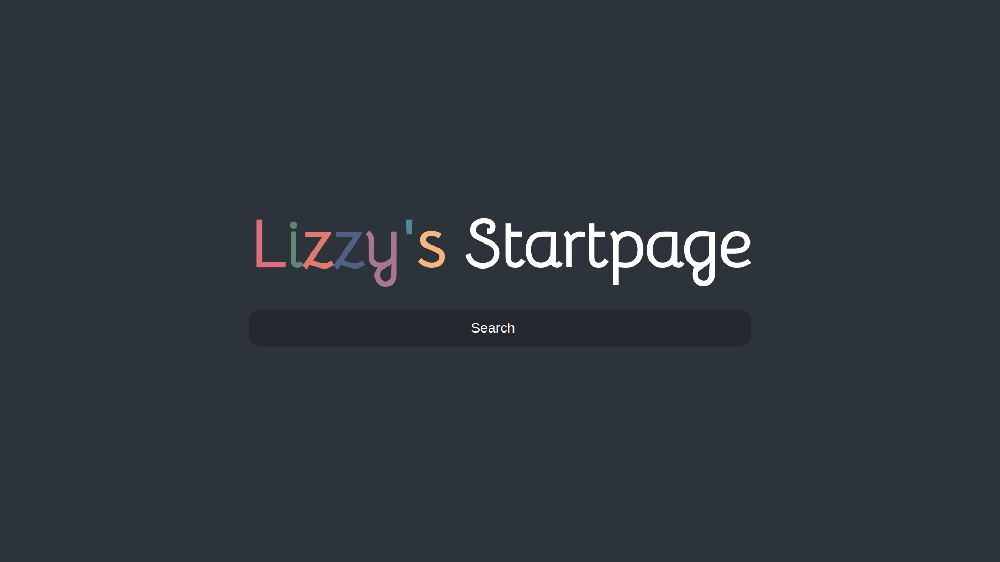

# My Startpage

> My Chrome new tab page

## Usage
I don't know why you would want to use this without modifying it, as it literally plasters my name in rainbow color above a search bar (unless your name is Lizzy, in which case hey sister!)

But here's how:

You need an extension to do this, [so here's one for Chrome](https://chrome.google.com/webstore/detail/new-tab-override/fjcmlondipcnnpmbcollgifldmajfonf) (sorry Firefox users, maybe later)

Basically open the options for that extension and paste https://lizainslie.dev/startpage/ in the url :)
