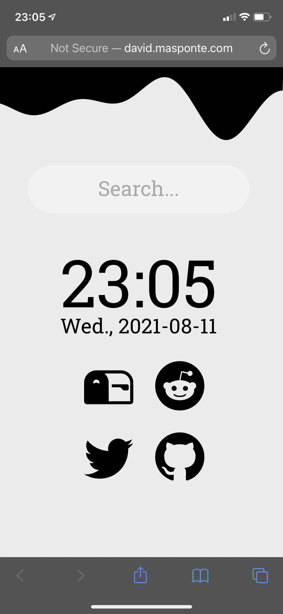
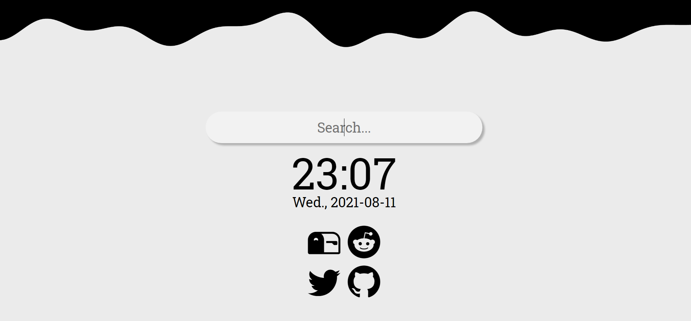
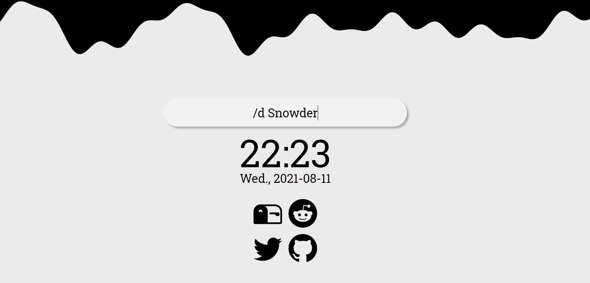
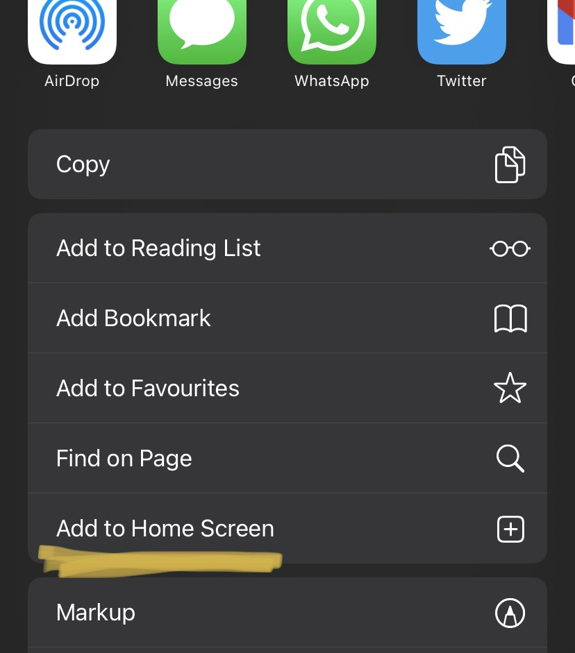
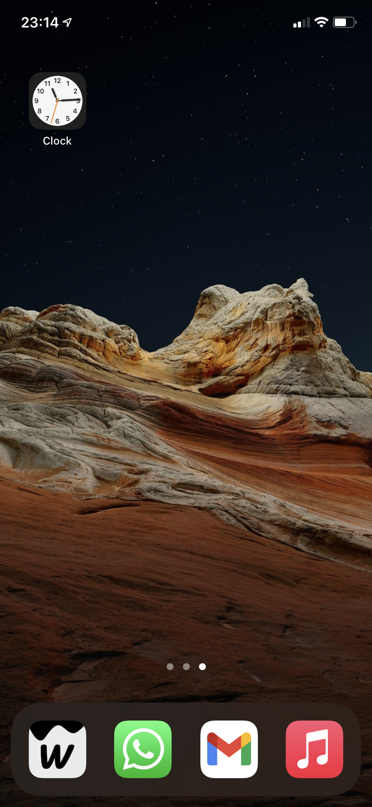

# wave-tab

Wave tab is a mobile-first and computer compatible start
page for your favorite browser. It contains a
randomly generated wave in the top of the page making your
browser experience a pleasant and relaxing and unique trip.

This page is hosted via github pages
[here](http://david.masponte.com/wave-tab).
You are also
free to fork or copy the code and include and personalize the
experience.

## Preview

A mobile first starting page:

A relaxing desktop experience:

## Usage

When launching the page your cursor will automatically be in the search bar.
You can type anything and press the enter key, then you will be redirected
to the search url from google.

The icons in the bottom part link common developer communities
like reddit, gmail, github and twitter. This might change in the future
and I want to provide the option to customize these icons.

### Commands

Currently, only 2 search commands are implemented. To run them use the keyword
`/<letter>` and type the rest of the string. Then press enter.

* `/g` Searchs in google search (also works as default)
* `/d` Searchs the input string in [DuckDuckGo](https://duckduckgo.com/)

### Extra

If you want to save the web site as an App in an iPhone device (webApp)
you can use the funcionality (`save to Home Screen`) which is built into
the safari share button.

The page will be saved in the home screen with a custom logo and every time
you press it will re-direct you to that same page.

## Tools used

To implement this start page I used basically HTML/CSS and Javascript.

To implement the wave pattern in the top I used the library
[p5js](https://github.com/processing/p5.js/) and
in particular took much of the concepts and inspiration from the
[coding train video about sin waves](https://www.youtube.com/watch?v=okfZRl4Xw-c).
